# The V4 tile set: fifteen coordinated erosion tiles

Fifteen tiles, exactly one for each typology of Assignment 2 (three categories x five typologies), built with the real engine (`erosion_engine_7.py`, run headless on Rhino's own Python), read by the app's own code, and assembled by Arrange's own rules. They are a second, deliberate set: the first set (`engine/tiles/recipes`, no version label) is untouched, the V4 names carry `_v4`, the tile ids differ, and the Analysis tab compares the two as variants of each typology.

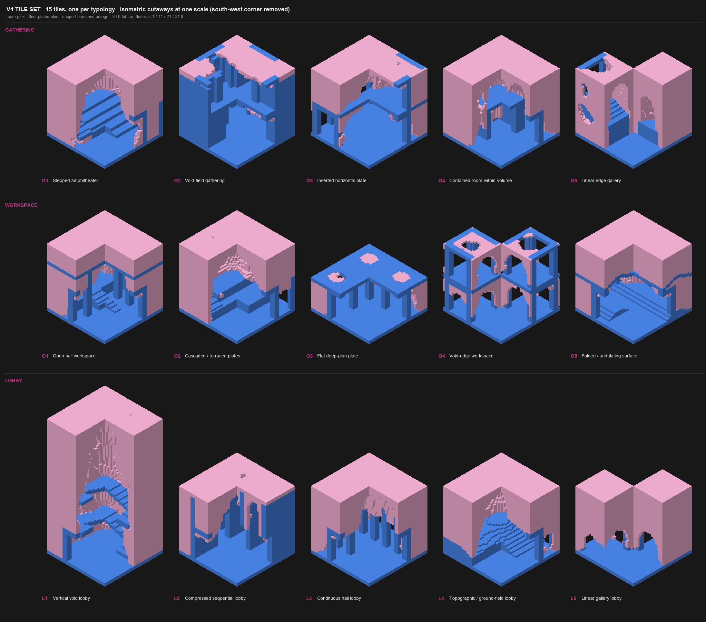

*Isometric cutaways at one scale (the south-west corner removed above the ground slab). Pink foam, blue floor plates, orange support branches. L1 is 40 ft tall; O3 is one 10 ft storey; G5, O4 and L5 are L-plans with a 10 x 10 ft notch.*

**Where things are**

| What | Where |
|---|---|
| the recipes (paste one into the engine's `recipe` panel; it ends with `RECIPE CHECK: OK`) | `engine/tiles/v4/recipes/<name>.recipe.json` |
| the tile definitions (one function per tile; the docstring is the concept) and the kit | `engine/tiles/v4/defs_g.py`, `defs_o.py`, `defs_l.py`, `kit4.py` |
| pictures per tile: sections, a **walking sheet** (green = floor a person can walk), an isometric cutaway | `engine/tiles/v4/recipes/previews/` |
| the evaluation table the app computes (generated) | `engine/tiles/v4/EVALUATION.md` |
| assembly evidence: the check's full output and pictures of automatic assemblies | `engine/tiles/v4/assemblies/` |
| import-ready `_analysis` exports, the engine's `_reference` outputs, the whole set in one zip (local, git-ignored, about 100 MB) | `engine/tiles/v4/package/` (made by `engine/tiles/v4/package.py`) |
| committed fixtures (voxels + the engine's own analysis) for the regression checks | `lib/tiles/fixtures-v4/` |
| the conventions, written for whoever writes the next set | `docs/RECIPE_AUTHORING.md` (the V4 section) |

**Commands** (Rhino's Python 3.9 for the engine; `npm` for the rest)

```
python engine/tiles/v4/build.py [G1 O3 ...]       write the recipe, run the real engine, export, draw sections and the walking sheet
python engine/tiles/v4/verify.py                  rebuild each stored recipe from the file alone and check RECIPE CHECK: OK, 24 sources, 32,000 characters, metadata
python engine/tiles/v4/iso.py --all ; python engine/tiles/v4/overview.py     isometric cutaways, the 3 x 5 overview
python engine/tiles/make_fixtures.py C:/tmp/tiles4 lib/tiles/fixtures-v4      then:  npm run check:parity   (the app's analysis equals the engine's, all 30 tiles incl. masks)
npm run check:v4                                  assemble them every way Arrange can (writes engine/tiles/v4/assemblies/)
npx tsx scripts/v4/table.ts                       the evaluation table
python engine/tiles/v4/package.py                 the zips
```

## 1. The design matrix

Every tile answers the same questions, so the set is a *family* and not fifteen objects. Each row says what the tile *is* (the typology idea as a section and a sequence of spaces), how erosion makes it (what is retained, what is carved), how a person gets through and up it, and how it meets its neighbours.

| | Typology idea | Section and sequence | Erosion logic | Circulation | Interfaces |
|---|---|---|---|---|---|
| **G1** | Stepped amphitheater | a flat stage at the south, five seating terraces (1 ft risers, 2.2 ft treads) climbing to a rear walk 5 ft up, one tall dome over all | seating are retained plate-stepped solids; one tunnel per bay rides the terraces up so the roof steps with the seating | the terraces are *seats*, not steps: a separate 4 ft aisle stair (0.37 slope, 0.5 ft risers) along the west wall is the only way up | doors on the stage: -y centre, +-x at u = 4 (D0) |
| **G2** | Void-field gathering | two floors, each a *field* of separate rooms (a great round room, four satellites, links) divided by foam walls 1.5 to 3 ft thick | the walls are retained plates (poche); each room is its own pod; doorways are capsule links | ground field joins the faces; the upper field is a **receiving floor** (no stair of its own) | doors on all four faces, both floors (u = 10) |
| **G3** | Inserted horizontal plate | a plate at 11 ft grows out of the south wall and ends in a curved free edge; a low room under it, a hall over it, a double-height hall beyond its edge | one retained plate; pods under, over and beyond | ground floor joins the faces; the plate is a **receiving floor** | doors on four faces at the ground, three on the plate |
| **G4** | Contained room-within-volume | a 10 x 9 ft room 9 ft high, with its own roof plate and one 3.6 ft door, standing in a tall volume that wraps it on all sides and rises over its roof | the room is a retained plate enclosure; the volume is pods round and over it | forecourt, side passages, the room; its roof deck is seen from the hall and reached from nowhere (an object in the volume) | doors into the forecourt: -y centre, +-x at u = 5 |
| **G5** | Linear edge gallery | an L-plan: one 7 ft gallery runs the whole L, from the east arm's end round the corner to the north arm's end, climbing as one ramp from 1 ft to 11 ft; the notch is an open court | a solid retained ramp wedge; headroom by a row of vertical pods starting at the ramp surface | the ramp *is* the building: arrive at the ground, leave at the upper floor | east door at the ground (tunnel tilted to the ramp), north door at the upper floor |
| **O1** | Open hall workspace | one hall about 16 ft square and 13 ft high under a flat ceiling slab, four slender piers clear of the middle, a platform along the north wall 3 ft up reached by a ramp up the middle | ceiling and piers retained; the hall is three pods over the floor, two over the ramp, three over the platform | a 7.5 ft ramp (slope 0.4) rises to a 5 ft deep platform that looks down on the hall | doors: -y centre, +-x at u = 8 |
| **O2** | Cascaded / terraced plates | three deep floors step up the tile, 2.5 ft at a time, each with solid foam under it; a ramp along the west wall climbs to the top | three retained plates (and a wedge ramp); one tall volume rides the cascade up | the drops between plates are 2.5 ft: walls to sit on. The ramp (slope 0.36) meets each plate where its floor is level with it, so one path reaches all three | doors: -y centre, +-x at u = 4 |
| **O3** | Flat deep-plan plate | a single 10 ft storey, 20 ft square: a floor plate and a roof plate and eight feet of air between, four piers, four round light wells through the roof plate | the tile *is* a plate: two slabs and piers; three long pools between them | one level | doors on all four faces (7.5 ft high, u = 10) |
| **O4** | Void-edge workspace | an L-plan with workspace on two floors, each a strip along the edge of one double-height void at the knuckle; the notch is the second void | the upper floor is one retained plate with a 4.5 ft hole at the void; arms eroded floor by floor | the upper floor is one connected strip round the void; a **receiving floor** | 12 doors: both floors, arm ends, far walls, notch walls |
| **O5** | Folded / undulating work surface | the floor and the roof are the same fold: flat benches at two heights joined by 0.44 slopes (a 1.5 ft rise), repeating every 10 ft; the roof follows 10.6 ft above | the floor and roof are retained height-field plates; five pools between them | you walk up and down the folds on gentle ramps | doors on the four faces on the valley line |
| **L1** | Vertical void lobby | 20 x 20 x **40** ft: one tall void and, round its walls, a single ramp that climbs two storeys in two turns | the ramp is a chain of plates; the void is three stacked lengths of pod so it stays as wide at the top | arrival and ascent are one thing: a 4 ft ramp (slope 0.31) with a flat landing at every corner; landings at the upper floors carry doors | door at the ground (west), doors at 11 and 21 ft on the south-west landing (south and west) |
| **L2** | Compressed sequential lobby | three tall chambers from south to north joined by *pinches*: 4 ft, 4 ft and 3.6 ft openings in full-height foam walls under lintels | three retained diaphragm walls with lintels; pods for each chamber and for each pinch | narrow, wide, narrow, wide, narrow, wide | doors on the south (through the pinch), both sides, the north |
| **L3** | Continuous hall lobby | a long nave, 9 ft wide and 17 ft high, flanked by two rows of four slender piers (an arcade) and, behind them, a low aisle | eight retained piers; a nave of four pods, four aisle pods | one continuous hall, end to end and through the aisles | doors on all four faces |
| **L4** | Topographic ground-field lobby | the floor is a landscape: a broad swell and two mounds rising from 1 ft to about 6 ft, none steeper than 0.45; the roof is the counter-landscape that follows it | one retained height-field plate; pools ride the ground up | walked as a field, not by stairs | doors: -y centre, +-x |
| **L5** | Linear gallery lobby | an L-plan: one long gallery along the L, swelling into a tall chamber at each arm end and the corner (beads on a string) | pods for the beads, two throats for the gallery | the gallery is how you arrive, the chambers are where you stop | 6 doors: arm ends, far walls, notch walls |

The *one* idea that makes the set a family and not a catalogue: **a 20 x 20 ft lattice with floors at 1, 11, 21 and 31 ft, and one standard doorway** (6 ft wide, 8 ft high above a floor, centred on a 5 ft line, with a retained frame that fixes the opening however the room behind it erodes). Everything else (an L-plan, a 10 ft storey, a 40 ft lobby, a ramp, an arcade, a pinch) is free to differ because the interfaces are agreed.

Some architectural differences are also *programmatic*: the lobbies and gathering tiles with ramps (L1, G5, O2's cascade, O1's hall) are the set's **producers of vertical circulation**; G2, G3 and O4 are **receivers**: their upper floors have no stair of their own and are reached where a neighbour's ramp arrives at 11 ft. The assembly checks below measure that rather than assume it.

## 2. The tiles, one by one

For each: what it is, how erosion makes it, how people move, how it connects. Pictures: the isometric cutaway and the walking sheet (green = the main floor a person can walk; cyan = another real floor).

### Gathering

**G1, Stepped amphitheater** (`gathering_1_stepped_amphitheater_v4`). *Intent:* a bowl you can read in section. A stage floor at the ground datum, five seating terraces of 1 ft risers (they are *seats*, and the 1 ft riser is more than the 0.5 ft the program allows as a step), and a rear walk at 6 ft. *Erosion:* the seating and the rear mass are retained plate solids built as stepped boxes; the void is one tunnel per bay, each riding the terraces up so the roof of the bowl steps with the seating, and two high tunnels make the dome. *Circulation:* the way up is a **separate** 4 ft aisle stair along the west wall (0.5 ft risers); a person walks the stage, climbs the aisle, and steps onto any row from it. *Connections:* doors onto the stage on the south and on both sides at the ground datum; there is no door at the rear (the seating is there).
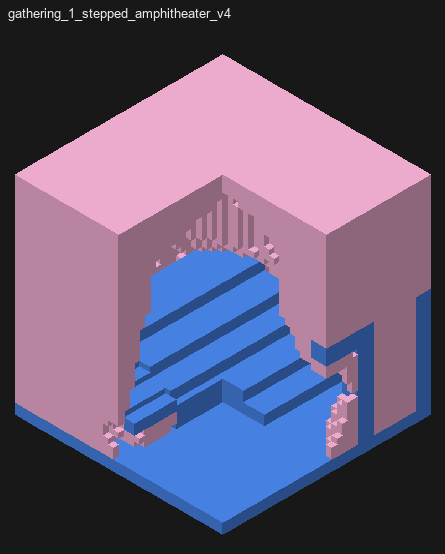 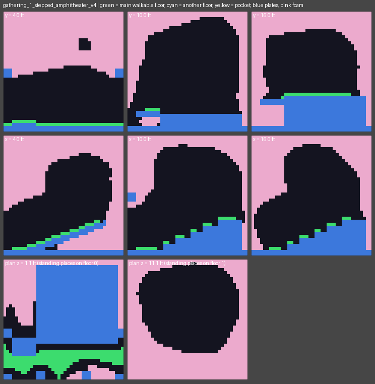

**G2, Void-field gathering** (`gathering_2_void_field_gathering_v4`). *Intent:* no hall: a field of separate rooms, each its own void, divided by foam you can see is thick. *Erosion:* the walls are retained plates drawn as a poche (rooms cut out of a solid slab with a little hand wobble); each room is its own pod; doorways are capsule links. The ground field is a great round room with four satellites at the corners; the upper field is a different one (a cross of satellites). *Circulation:* the ground field is one connected floor; the upper field is a **receiving floor**: no stair of its own, a neighbour's ramp arrives at it. *Connections:* a doorway on each of the four faces on each floor (u = 10).
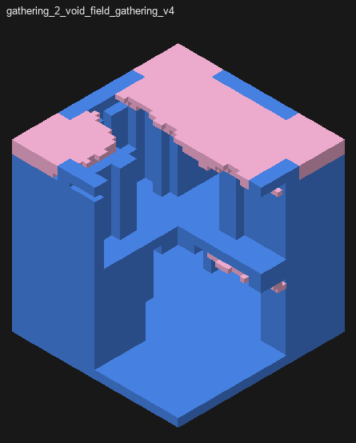 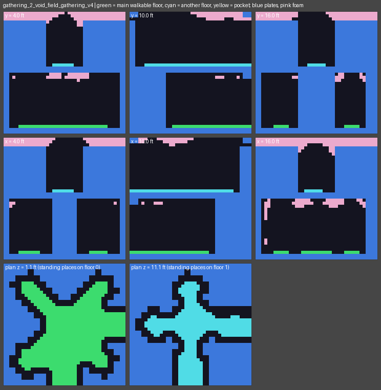

**G3, Inserted horizontal plate** (`gathering_3_inserted_horizontal_plate_v4`). *Intent:* the plate is the whole idea, so nothing else is allowed to look like it. *Erosion:* one retained plate at 11 ft that is full width where it meets the south wall (the doors) and ends in a curved free edge a little past the middle; below it a low ground room (three pods); above it the hall (three pods that start on the plate); beyond its edge a tall double-height hall. *Circulation:* the ground floor joins the faces; the plate is a **receiving floor** reached where a neighbour's ramp arrives at 11 ft. *Connections:* four doors at the ground, three on the plate.
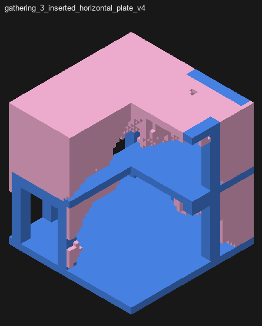 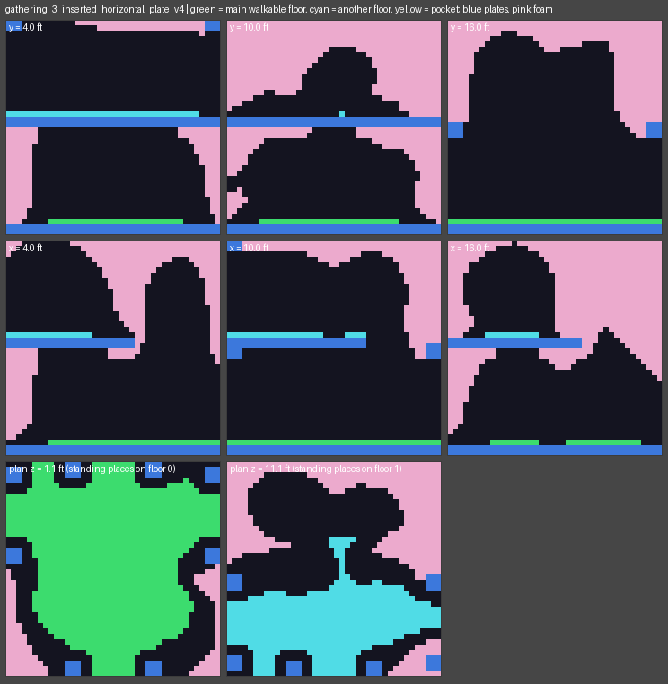

**G4, Contained room-within-volume** (`gathering_4_contained_room_within_volume_v4`). *Intent:* a small room contained inside a larger space. *Erosion:* the room's walls (1.5 ft) and roof are retained plates, so they resist the erosion that made everything round them; the volume wraps the room on every side (forecourt, two side passages, a rear pocket) and rises over its roof into one tall hall. *Circulation:* forecourt, side passages and the room's own 3.6 ft door; the room's roof deck is seen from the hall and reached from nowhere: an object in the volume, by design. *Connections:* doors into the forecourt (south, both sides).
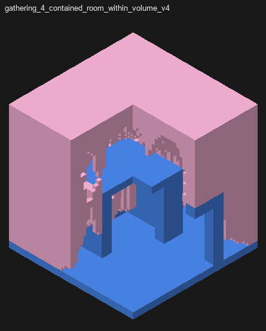 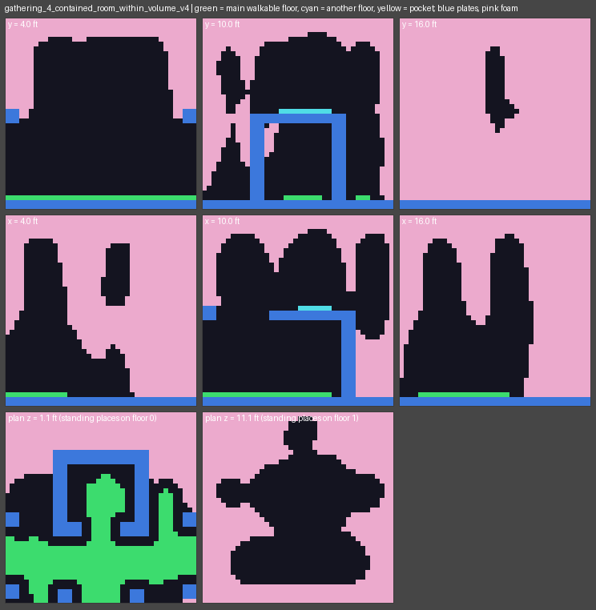

**G5, Linear edge gallery** (`gathering_5_linear_edge_gallery_v4`). *Intent:* an edge you walk along. An L-plan whose one 7 ft gallery runs the whole length of the L, from the east arm's end round the corner to the north arm's end, climbing as one ramp from the ground (1 ft) to the upper datum (11 ft); the notch beside it is an open court, behind it a thick wall of foam. *Erosion:* the ramp is a **solid** retained wedge (so the solvent cannot undercut it); headroom is a row of seven vertical pods that start at the ramp's surface. The east door's tunnel is tilted to the ramp so the doorway opens onto a walkable floor. *Circulation:* slope 0.44, 0.5 ft risers, one corner landing; the whole gallery is one walkable floor from 1.0 to 11.5 ft. *Connections:* east door at the ground, north door at the upper floor; its ramp is what lets another tile stand at 11 ft (see the vertical results).
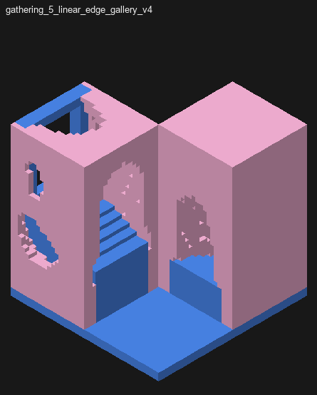 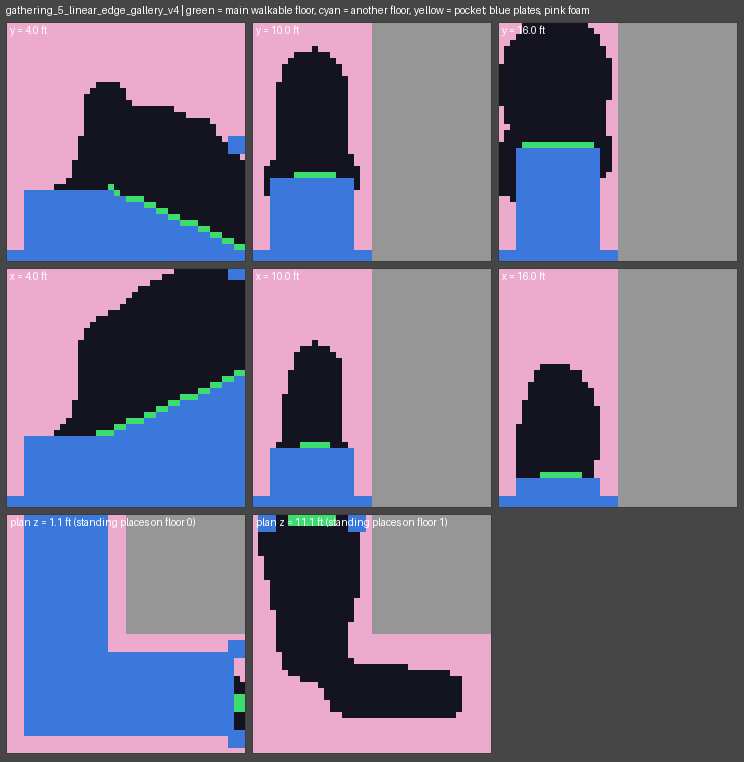

### Workspace

**O1, Open hall workspace** (`office_1_open_hall_workspace_v4`). *Intent:* one hall you can see across, no partitions. *Erosion:* a flat retained ceiling slab at 15 ft, four slender retained piers, a retained ramp wedge and platform; three pods eat the hall floor, two follow the ramp, three sit over the platform so the void reaches the ceiling everywhere. *Circulation:* a 7.5 ft ramp (slope 0.4) up the middle of the hall to a 5 ft deep platform along the north wall, 3 ft up: the one place that looks down on the rest. *Connections:* doors on the south and both sides at the ground (u = 10 and 8).
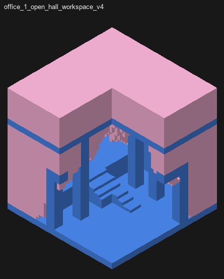 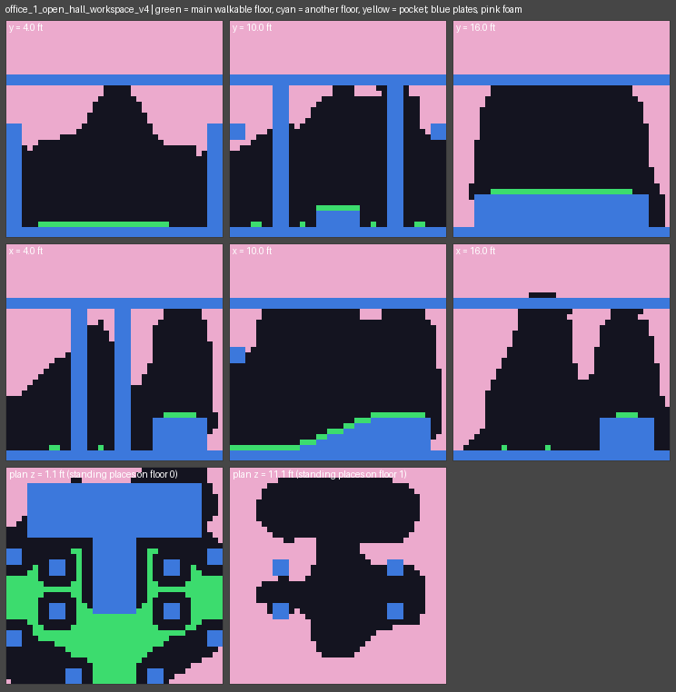

**O2, Cascaded / terraced plates** (`office_2_cascaded_terraced_plates_v4`). *Intent:* floors stepping up like a cascade, each deep and wide enough to work on. *Erosion:* two retained plates on solid foam (the "hill") and a wedge ramp with a landing; a tall volume rides the cascade up, one tunnel above each plate, and a small pod bridges the landing to the top plate. *Circulation:* the drops between plates are 2.5 ft (too high to step: they are walls to sit on); a 4 ft ramp along the west wall (slope 0.36) meets each plate where its floor is level with it, so the plates are reached one after another by one path (one walkable floor from 1.0 to 6.5 ft). *Connections:* doors on the south and both sides at the ground.
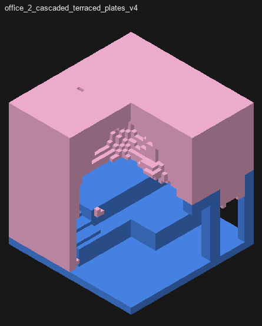 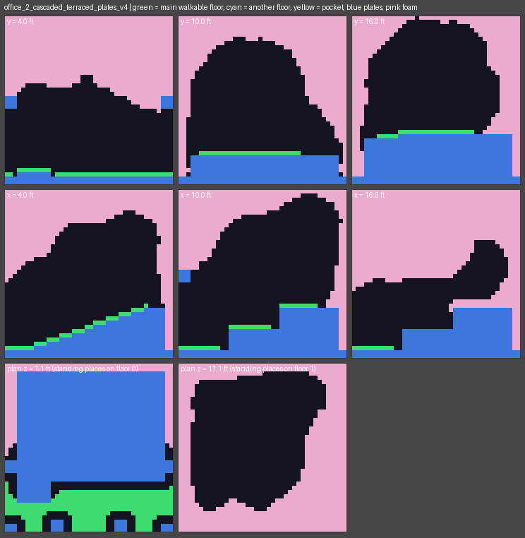

**O3, Flat deep-plan plate** (`office_3_flat_deep_plan_plate_v4`). *Intent:* the tile *is* a plate: one storey, 20 ft by 20 ft and 10 ft high. *Erosion:* a floor plate and a roof plate with four round light wells through it, four retained piers; three long pools fill the space between them to 8 ft of clear height. *Circulation:* one level, 188 ft² of floor. *Connections:* doors (7.5 ft high) on all four faces.
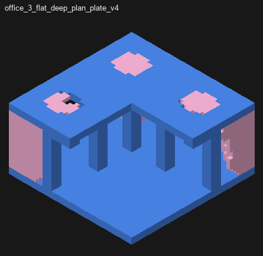 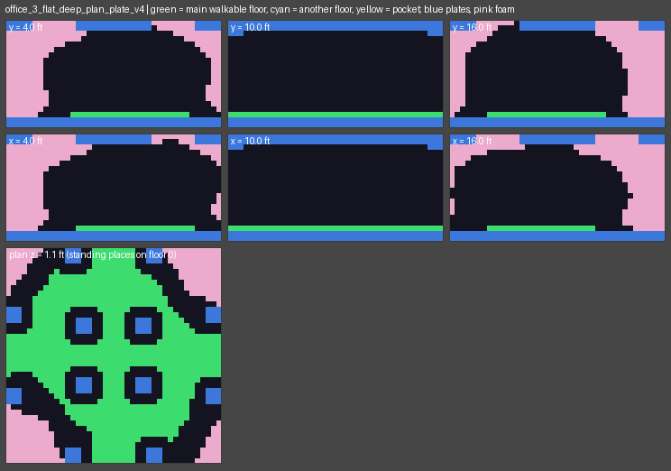

**O4, Void-edge workspace** (`office_4_void_edge_workspace_v4`). *Intent:* workspace on the edge of a void. An L-plan with two floors; at the knuckle a double-height void, open to both floors; the notch is the second void, open to the sky and free for a neighbour. *Erosion:* the upper floor is one retained plate with a 4.5 ft opening at the void, wide enough to leave a connected strip round it; arms are eroded floor by floor; throats join the knuckle to each arm. *Circulation:* the upper floor is one connected strip round the void and a **receiving floor**; the main floor is the ground floor. *Connections:* twelve doors: at both floors at each arm's end, through each arm's far wall, and through the two walls of the notch, so a neighbour that fills the notch can walk in.
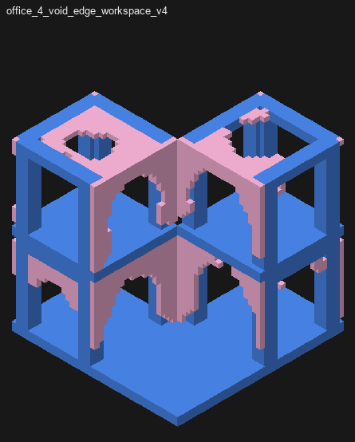 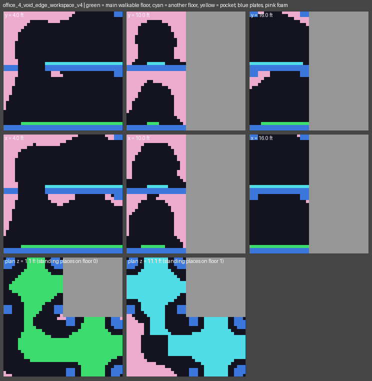

**O5, Folded / undulating work surface** (`office_5_folded_undulating_work_surface_v4`). *Intent:* floor and roof are the same fold: a folded tube you work in. *Erosion:* a retained folded floor (a height-field plate: flat valley benches 1.6 ft wide and flat ridge benches, joined by 3.4 ft slopes rising 1.5 ft, every 10 ft) and a retained folded roof 10.6 ft above it; three long pools along the folds and two across. *Circulation:* the work happens on the benches at two heights; people moving across the folds walk gentle 0.44 ramps; one walkable floor, 228 ft². *Connections:* doors on the four faces on the valley line at the ground datum.
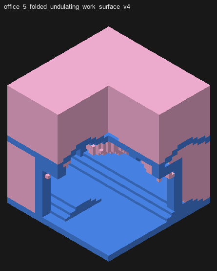 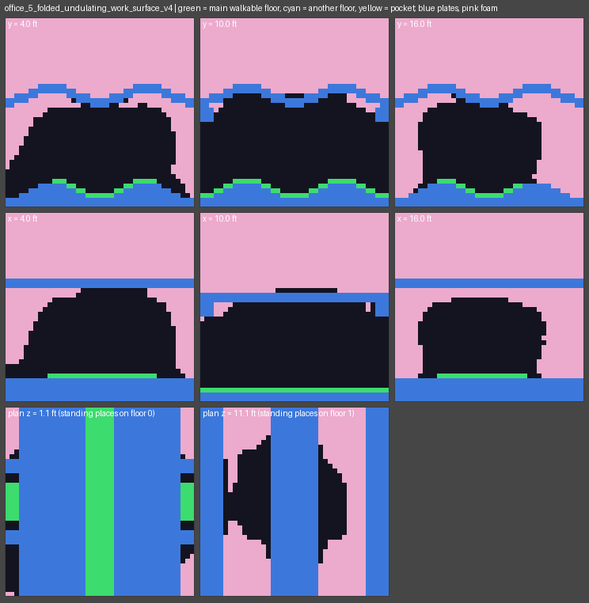

### Lobby

**L1, Vertical void lobby** (`lobby_1_vertical_void_lobby_v4`). *Intent:* arrival and the rise through the building are one thing: you come in at the foot of the void and climb round it. 20 x 20 x **40** ft (two lattice increments). *Erosion:* a single ramp, a chain of retained plates, winds round the walls twice; the void is three stacked lengths of pod so it is as wide at 38 ft as at the ground. *Circulation:* a 4 ft ramp (slope 0.31, 0.5 ft risers) with a flat 4 x 4 ft landing at every corner; one walkable floor from 1.0 to 21.5 ft; three levels reached. *Connections:* a door at the ground on the west wall (the one wall the ramp passes last, high up), doors at 11 ft and 21 ft on the south-west corner landing (south and west faces, with a floor sill). It is the set's strongest producer of vertical circulation: every other tile can stand at its upper floors and be reached up its ramp.
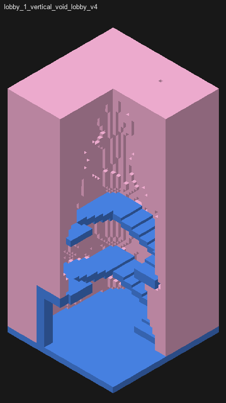 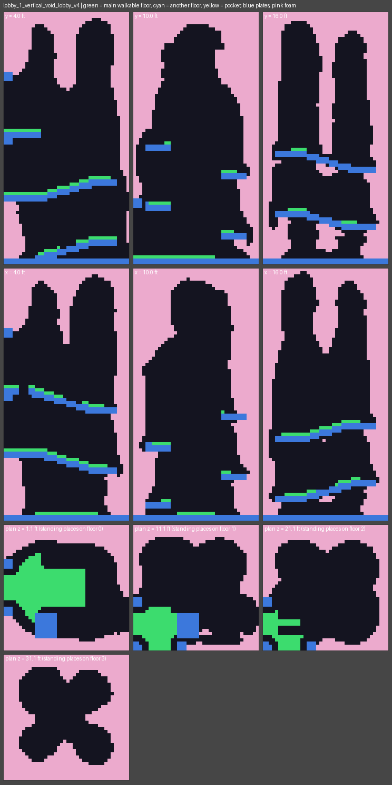

**L2, Compressed sequential lobby** (`lobby_2_compressed_sequential_lobby_v4`). *Intent:* the way in goes low and narrow, high and wide, narrow, wide, narrow, wide. *Erosion:* three retained diaphragm walls, each with a lintel over a 3.6 to 4 ft opening; three chambers (8 to 14 ft across, 17.6 ft high) and a pinch pod per opening that clears from the floor to the lintel. *Circulation:* one walkable floor straight through all three chambers; each pinch is a real constriction the Spatial density descriptor finds (0.23). *Connections:* south (through the first pinch), both sides at the middle chamber, north.
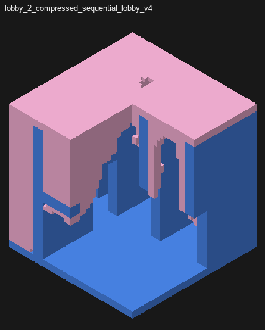 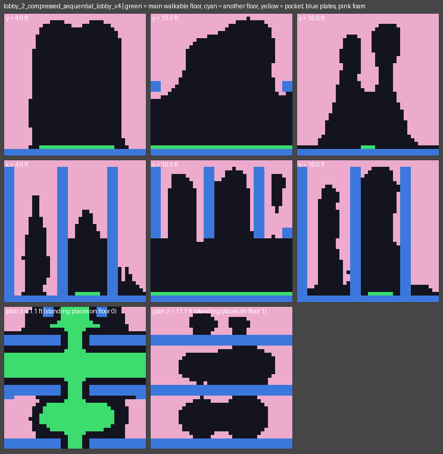

**L3, Continuous hall lobby** (`lobby_3_continuous_hall_lobby_v4`). *Intent:* a hall whose walls are a rhythm, not a surface. *Erosion:* eight retained piers (two rows of four, an arcade) and a nave of four pods; four aisle pods behind the piers. *Circulation:* one hall end to end and through the aisles. *Connections:* a door on each of the four faces.
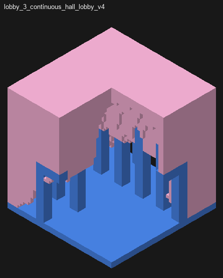 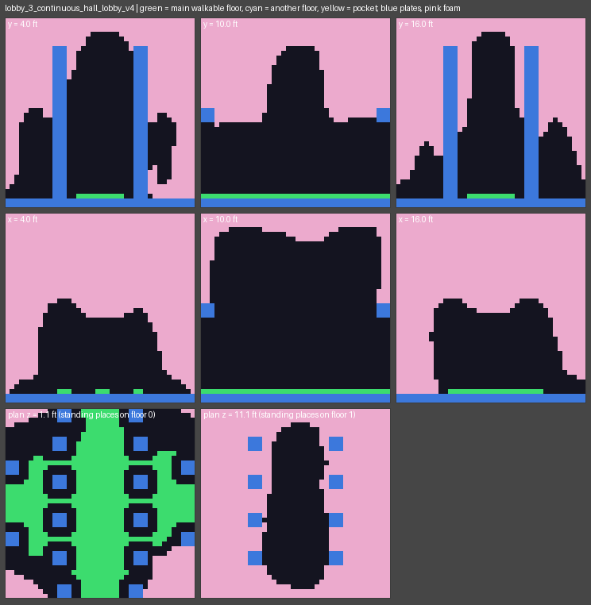

**L4, Topographic / ground-field lobby** (`lobby_4_topographic_ground_field_lobby_v4`). *Intent:* the floor is a landscape and the roof the counter-landscape. *Erosion:* one retained height-field plate (a smoothstep swell of 4.2 ft and two 0.8 ft mounds), four long pools that ride the ground up and one under the vault. *Circulation:* walked as a field, never steeper than 0.45, from 1 ft at the south to about 6 ft at the north; one floor, 213 ft². *Connections:* south and both sides at the ground datum.
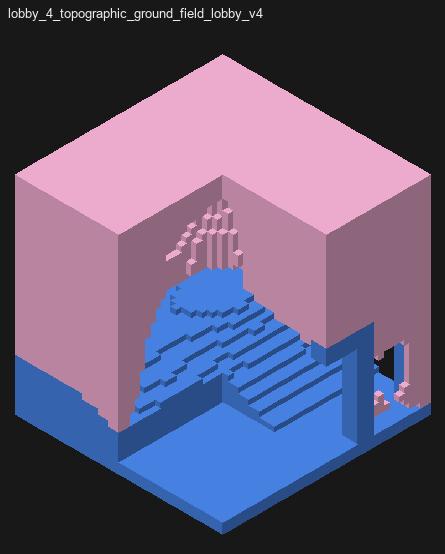 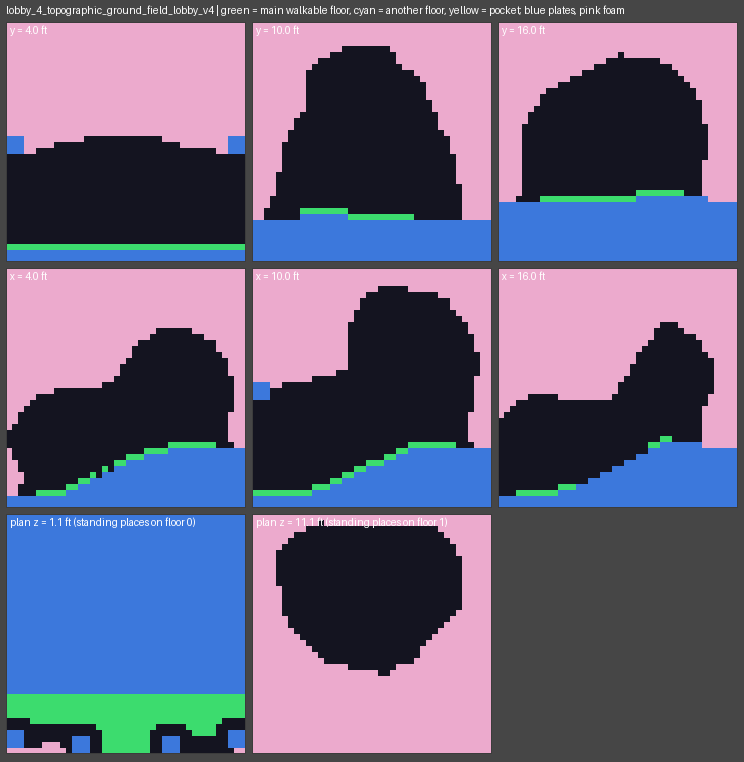

**L5, Linear gallery lobby** (`lobby_5_linear_gallery_lobby_v4`). *Intent:* a gallery to arrive by, chambers to stop in: beads on a string. An L-plan. *Erosion:* three tall pods (the beads) at the arm ends and the corner and two throats (the 7 ft by 8 ft gallery) between them. *Circulation:* one floor along the whole L. *Connections:* six doors: the end of each arm, the far wall of each arm, and through both walls of the notch.
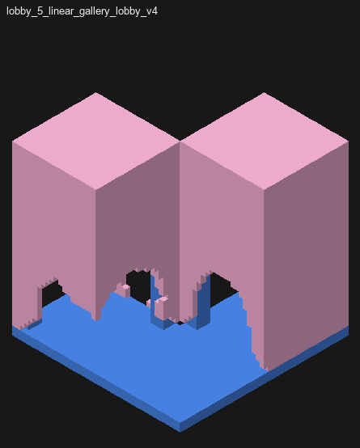 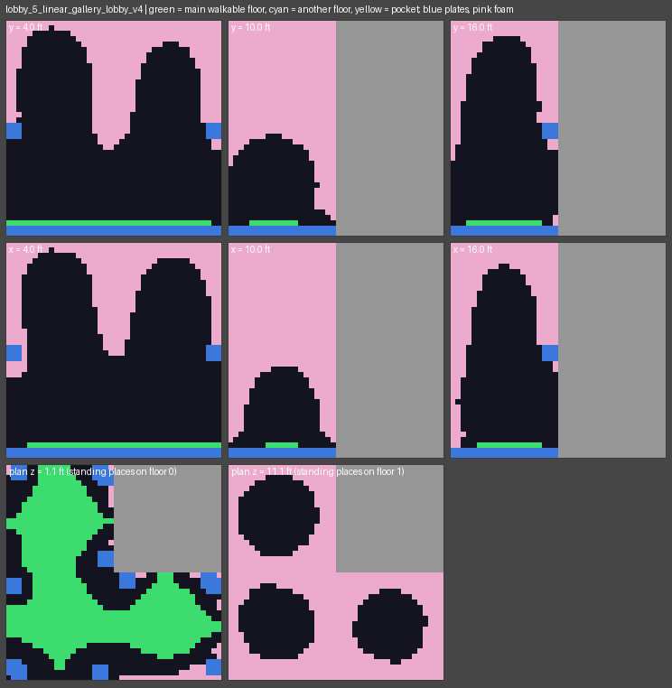

## 3. Evaluation and selection

**How a tile was selected.** Each typology has exactly one selected V4 tile. Candidates were built with the real engine and read with the app's own code (the walking sheet, the usable-space check, the twelve descriptors, the section and plan pictures) in a loop of *build, inspect, change one thing, rebuild*; a version was kept only if its typology read in section, its main floor was one connected walkable floor reached from a doorway, its openings were the standard 6 x 8 ft doorways at the family datums, it stayed within 24 sources and 32,000 characters, and it reproduced its tile id from the recipe alone (`verify.py`). The Analysis tab's variant comparison is deliberately *not* used to rank the tiles (the fifteen typologies are never ranked against each other, and it does not force a pick); it is used below to put each V4 tile beside the first set's tile of the same typology.

### 3.1 Floor, circulation and usability (computed by the app)

| tile | size ft | floor reached on foot from a ground opening | real floors (zones) | levels reached | void reached | too tight to use |
|---|---|---|---|---|---|---|
| G1 | 20 x 20 x 20 | 51% of 326 ft² | 1 (main 166 ft²) | 1/1 | 53% | 160 ft² |
| G2 | 20 x 20 x 20 | 38% of 428 ft² | 2 (main 163 ft²) | 1/4 | 39% | 173 ft² |
| G3 | 20 x 20 x 20 | 49% of 525 ft² | 2 (main 256 ft²) | 1/2 | 56% | 151 ft² |
| G4 | 20 x 20 x 20 | 39% of 309 ft² | 2 (main 120 ft²) | 1/3 | 49% | 163 ft² |
| G5 | 20 x 20 x 20 | 51% of 186 ft² | 1 (main 94 ft²) | 1/1 | 56% | 92 ft² |
| O1 | 20 x 20 x 20 | 51% of 318 ft² | 1 (main 164 ft²) | 2/3 | 56% | 154 ft² |
| O2 | 20 x 20 x 20 | 59% of 324 ft² | 1 (main 190 ft²) | 1/2 | 63% | 134 ft² |
| O3 | 20 x 20 x 10 | 63% of 297 ft² | 1 (main 188 ft²) | 1/1 | 65% | 109 ft² |
| O4 | 20 x 20 x 20 | 33% of 474 ft² | 2 (main 155 ft²) | 1/3 | 38% | 170 ft² |
| O5 | 20 x 20 x 20 | 77% of 298 ft² | 1 (main 228 ft²) | 1/3 | 79% | 70 ft² |
| L1 | 20 x 20 x 40 | 56% of 617 ft² | 1 (main 345 ft²) | 3/3 | 63% | 272 ft² |
| L2 | 20 x 20 x 20 | 56% of 255 ft² | 1 (main 144 ft²) | 1/1 | 63% | 111 ft² |
| L3 | 20 x 20 x 20 | 56% of 288 ft² | 1 (main 162 ft²) | 1/1 | 66% | 126 ft² |
| L4 | 20 x 20 x 20 | 68% of 314 ft² | 1 (main 213 ft²) | 1/1 | 74% | 101 ft² |
| L5 | 20 x 20 x 20 | 61% of 260 ft² | 1 (main 160 ft²) | 1/1 | 75% | 100 ft² |

The twelve descriptors for every tile are in [`engine/tiles/v4/EVALUATION.md`](../engine/tiles/v4/EVALUATION.md) (generated). Force-driven reads "not assessable" there because the committed fixtures carry no recipe; in the app, a tile imported from its `_analysis` folder carries its recipe and Force-driven is measured. Retained is 100% of plan area for every tile because every tile has a ground slab.

### 3.2 The V4 tile beside the first set's tile, as the Analysis tab's variant comparison reads them

Strength, fit and usability are kept apart, a missing result is never a zero, and a pick is made only where the evidence supports one. Usable = the share of the floor reached on foot from a ground opening.

```
  stepped amphitheater               tradeoff       usable stepped_amphitheater 14% / stepped_amphitheater V4 51%
  void field gathering               tradeoff       usable void_field_gathering 12% / void_field_gathering V4 38%
  inserted horizontal plate          insufficient   usable inserted_horizontal_plate 57% / inserted_horizontal_plate V4 49%
  contained room within volume       insufficient   usable contained_room_within_volume 28% / contained_room_within_volume V4 39%
  linear edge gallery                tradeoff       usable linear_edge_gallery 34% / linear_edge_gallery V4 51%
  open hall workspace                tradeoff       usable open_hall_workspace 57% / open_hall_workspace V4 51%
  cascaded terraced plates           tradeoff       usable cascaded_terraced_plates 13% / cascaded_terraced_plates V4 59%
  flat deep plan plate               tradeoff       usable flat_deep_plan_plate 16% / flat_deep_plan_plate V4 63%
  void edge workspace                tradeoff       usable void_edge_workspace 31% / void_edge_workspace V4 33%
  folded undulating work surface     insufficient   usable folded_undulating_work_surface 22% / folded_undulating_work_surface V4 77%
  vertical void lobby                pick         pick: lobby_1_vertical_void_lobby_v4  usable vertical_void_lobby 8% / vertical_void_lobby V4 56%
  compressed sequential lobby        tradeoff       usable compressed_sequential_lobby 68% / compressed_sequential_lobby V4 56%
  continuous hall lobby              tie            usable continuous_hall_lobby 34% / continuous_hall_lobby V4 56%
  topographic ground field lobby     tradeoff       usable topographic_ground_field_lobby 58% / topographic_ground_field_lobby V4 68%
  linear gallery lobby               tradeoff       usable linear_gallery_lobby 46% / linear_gallery_lobby V4 61%
  verdicts: tradeoff 10, insufficient 3, pick 1, tie 1
```

V4's usable share is higher than the first set's in 12 of 15 typologies (the first set's soft forms have many floors that a person cannot reach: the shared walking rules are stricter than the eye), and the comparison mostly reports *tradeoffs*, not winners: that is the intended behaviour, not a failure to decide.

### 3.3 Alternatives tried, and why the selected one stayed

These are recorded from the build-and-inspect loop, not from a scored tournament.

| Tile | Alternative | What went wrong | Selected |
|---|---|---|---|
| G1 | the seating drawn as a thin folded mesh | the mesh was not a simple polygon; the engine could not use it | stepped solid boxes |
| G1 | people climb the seating | 1 ft risers fail the one-step rule | the seating is seats, a separate 4 ft aisle stair is the way up |
| G5 | round horizontal tunnels over the ramp | left a foam wedge over the slope and breached the walls | vertical pods that start at the ramp surface |
| G5 | a ramp as a free plate | the solvent undercut it | a solid retained wedge |
| G5 | a level door tunnel at the ramp's foot | the doorway opened 1.5 ft above the floor | a tunnel tilted to the ramp (`Ports.add(..., slope=0.44)`) |
| O1 | a ramp to a plinth at the side | the plinth stayed a separate 49 ft² zone | a ramp up the middle to the platform |
| O2 | the landing and the top plate as two voids | a 28 ft² zone cut off | a bridging pod over the join |
| O4 | a 6 ft square void opening in the upper floor | left only a 1.5 ft ring: the two arms were two cut-off zones | a 4.5 ft opening and a connected strip |
| O4 | wider upper pods | the upper floor became the *biggest* floor, so Arrange took it as the main floor | upper pods reduced so the ground floor is the main floor |
| L1 | doors at the ground on every wall | the ramp passes over the east and north doors | the ground door on the west wall (the wall the ramp reaches last, high up); two loops, not three |
| L1, all | doors cut by dosing a tunnel and letting the room decide | openings of 20 to 80 ft² on the faces | the standard port: a tunnel plus a retained frame that fixes 6 x 8 ft |
| every ramp | slopes up to 0.6 | the walking rules' clear-disc test fails above about 0.5 | slopes of 0.45 or less, landings at the corners |

### 3.4 What is not clean (stated, not hidden)
- **Stray openings.** Seven openings of 13 to 23 ft² have no floor or clearance behind them: G5 (west face, 20 ft²), O1 (two), O4 (two), L1 (two). Each is a place where a pooled void came within about a foot of a face. Several tiles also have a few extra openings *with* a floor behind them (G3's north face has three): they act as additional doorways.
- **G4's roof deck** (the room's roof plate, 26 ft²) is a floor with headroom that nothing reaches: an object in the volume, by design. It is the one second floor in the set that is not a receiving floor.
- **Receiving floors.** G2's upper field, G3's plate and O4's upper floor have no stair of their own; they are reached where a neighbour's ramp arrives (measured below).
- **L1 is an end of the line**: its doors are on its west and south faces only (the walls its ramp does not cover), so the pair matrix, which places the second tile on the first's east side, can only use it as the second tile; 14 of 15 partners work either way round, and L1 + L1 needs a half turn.
- **Print and support checks** are diagnostics only. They pass wall thickness, plates joined to the body and contact with the bed for all 15; the overhang warning (15 to 24% of the foam surface faces down over a void) is the roofs and plates, expected in a building; four tiles carry a few specks of foam (0.1 to 0.3 ft³) outside the main body.

**Print and support checks, per tile (diagnostics)**
| tile | One piece | Wall thickness | Plates joined to the body | Overhangs | Contact with the print bed |
|---|---|---|---|---|---|
| G1 | ok | ok | ok | warn: 20% of the foam surface faces down over void (369 ft²); expect s | ok |
| G2 | ok | ok | ok | warn: 16% of the foam surface faces down over void (424 ft²); expect s | ok |
| G3 | ok | ok | ok | warn: 23% of the foam surface faces down over void (561 ft²); expect s | ok |
| G4 | ok | ok | ok | warn: 15% of the foam surface faces down over void (351 ft²); expect s | ok |
| G5 | ok | ok | ok | ok | ok |
| O1 | ok | ok | ok | warn: 17% of the foam surface faces down over void (368 ft²); expect s | ok |
| O2 | ok | ok | ok | warn: 20% of the foam surface faces down over void (344 ft²); expect s | ok |
| O3 | ok | ok | ok | warn: 23% of the foam surface faces down over void (326 ft²); expect s | ok |
| O4 | warn: 2 separate foam pieces, 0.1 ft³ outside the main body (specks) | ok | ok | warn: 22% of the foam surface faces down over void (467 ft²); expect s | ok |
| O5 | warn: 2 separate foam pieces, 0.1 ft³ outside the main body (specks) | ok | ok | warn: 24% of the foam surface faces down over void (368 ft²); expect s | ok |
| L1 | warn: 3 separate foam pieces, 0.3 ft³ outside the main body (specks) | ok | ok | warn: 17% of the foam surface faces down over void (802 ft²); expect s | ok |
| L2 | ok | ok | ok | ok | ok |
| L3 | warn: 2 separate foam pieces, 0.1 ft³ outside the main body (specks) | ok | ok | warn: 16% of the foam surface faces down over void (335 ft²); expect s | ok |
| L4 | ok | ok | ok | warn: 21% of the foam surface faces down over void (341 ft²); expect s | ok |
| L5 | ok | ok | ok | warn: 16% of the foam surface faces down over void (286 ft²); expect s | ok |

## 4. Compatibility results (`npm run check:v4`)

Every number in this section is read by the app's own Arrange code from the committed fixtures. A piece counts only if it is attached, collision-free under the occupancy policy (material never enters another tile's carved space, carved space is never shared), and its main floor is reachable on foot from the entrance. No walking or collision rule is relaxed. The check's full output is `engine/tiles/v4/assemblies/results.txt`.

### 4.1 Every pair (225 ordered pairs)
The best placement of the second tile (column) against the first (row) over eight orientations, lining up doors and floors; **W** = a walkable joint that joins the two main floors.

```
      G1  G2  G3  G4  G5  O1  O2  O3  O4  O5  L1  L2  L3  L4  L5 
  G1  W   W   W   W   W   W   W   W   W   W   W   W   W   W   W  
  G2  W   W   W   W   W   W   W   W   W   W   W   W   W   W   W  
  G3  W   W   W   W   W   W   W   W   W   W   W   W   W   W   W  
  G4  W   W   W   W   W   W   W   W   W   W   W   W   W   W   W  
  G5  W   W   W   W   W   W   W   W   W   W   W   W   W   W   W  
  O1  W   W   W   W   W   W   W   W   W   W   W   W   W   W   W  
  O2  W   W   W   W   W   W   W   W   W   W   W   W   W   W   W  
  O3  W   W   W   W   W   W   W   W   W   W   W   W   W   W   W  
  O4  W   W   W   W   W   W   W   W   W   W   W   W   W   W   W  
  O5  W   W   W   W   W   W   W   W   W   W   W   W   W   W   W  
  L1  .   .   .   .   .   .   .   .   .   .   .   .   .   .   .  
  L2  W   W   W   W   W   W   W   W   W   W   W   W   W   W   W  
  L3  W   W   W   W   W   W   W   W   W   W   W   W   W   W   W  
  L4  W   W   W   W   W   W   W   W   W   W   W   W   W   W   W  
  L5  W   W   W   W   W   W   W   W   W   W   W   W   W   W   W  
```

- 210 of 225 ordered pairs (93%) have a walkable joint in their best placement  (15 s)
- counted either way round: 119 of 120 unordered pairs (99%) can be joined on foot

The only row without a W is L1 as the *first* tile: the matrix places the second tile on the first's east face and L1 has no east door; L1 as the second tile is W against all 14.

### 4.2 Repeat, mirror and shift of one tile, 2, 4 and 8 copies (the Arrange tab's interlock test)
**V** = valid (attached, no collision, every copy reachable on foot); **a** = attached and collision-free but at least one copy is not reachable; **X** = detached or colliding.

| tile | repeat 2 | repeat 4 | repeat 8 | mirror 2 | mirror 4 | mirror 8 | shift 2 | shift 4 | shift 8 |
|---|---|---|---|---|---|---|---|---|---|
| G1 | V | a | a | V | a | a | a | a | a |
| G2 | a | a | a | V | a | a | a | a | a |
| G3 | V | V | a | V | V | a | a | a | a |
| G4 | V | a | a | V | a | a | a | a | a |
| G5 | a | a | a | V | V | a | X | a | a |
| O1 | V | a | a | V | a | a | a | a | a |
| O2 | V | a | a | V | a | a | a | a | a |
| O3 | V | V | a | V | V | a | a | a | a |
| O4 | a | a | a | V | V | a | X | a | a |
| O5 | V | V | a | V | V | a | a | a | a |
| L1 | a | a | a | a | a | a | a | a | a |
| L2 | V | V | a | V | V | a | a | a | a |
| L3 | V | V | a | V | V | a | a | a | a |
| L4 | V | a | a | V | a | a | a | a | a |
| L5 | V | a | a | V | V | a | X | a | a |

14 of 15 tiles make at least one valid repeat / mirror / shift aggregation by themselves. 2 and 4 copies are valid where a tile's doors are on both faces of each axis the pattern joins (G3, O3, O5, L2 and L3 in repeat 2 and 4 and mirror 2 and 4; the L-plans in mirror 4, where the mirrored copies' door faces meet). 8 copies are never fully walkable: the upper layer stands on air, and no tile has a way up through its own roof (a stack joins spaces by air, never by a route). Shifts mostly fail to give every copy a walkable door because a half-tile offset moves a 6 ft doorway off its partner (only a face with doors at both u = 5 and u = 15 would line up), and a half-tile shift of an L-plan leaves the copies touching nothing (X). These are the limits of the family's door positions, reported as they are.

### 4.3 Nesting: the L-plan tiles into each other's notch
- G5 + G5: 36 collision-free nested placements, 0 of them with a walkable joint and both pieces reachable
- G5 + O4: 36 collision-free nested placements, 8 of them with a walkable joint and both pieces reachable
- G5 + L5: 36 collision-free nested placements, 7 of them with a walkable joint and both pieces reachable
- O4 + G5: 36 collision-free nested placements, 12 of them with a walkable joint and both pieces reachable
- O4 + O4: 36 collision-free nested placements, 24 of them with a walkable joint and both pieces reachable
- O4 + L5: 36 collision-free nested placements, 28 of them with a walkable joint and both pieces reachable
- L5 + G5: 36 collision-free nested placements, 3 of them with a walkable joint and both pieces reachable
- L5 + O4: 36 collision-free nested placements, 14 of them with a walkable joint and both pieces reachable
- L5 + L5: 36 collision-free nested placements, 16 of them with a walkable joint and both pieces reachable

Only the L-plans have a notch another tile can fill; G5 into G5 does not walk because G5 has no door on a notch wall (the notch walls are a ramp wall at off-datum heights).

### 4.4 Vertical meetings: a tile standing with its ground floor at an upper level of a ramp tile
- the ring ramp of L1: 14 of 14 other tiles stand at an upper level of the host and are reached on foot (G1 G2 G3 G4 G5 O1 O2 O3 O4 O5 L2 L3 L4 L5)  [1199 walkable raised placements checked]
- the gallery ramp of G5: 14 of 14 other tiles stand at an upper level of the host and are reached on foot (G1 G2 G3 G4 O1 O2 O3 O4 O5 L1 L2 L3 L4 L5)  [204 walkable raised placements checked]

### 4.5 Receiving floors: the share of a tile's floor that a person reaches
- G2: 64% of its floor on its main floor alone; 100% best beside L1
- G3: 68% of its floor on its main floor alone; 100% best beside L1
- G4: 82% of its floor on its main floor alone; 82% best beside (alone)
- (G4: its other floor is not a receiving floor by design)
- O4: 51% of its floor on its main floor alone; 100% best beside L1

### 4.6 Auto Generate over the whole bank (`generateArrangement`, five shapes, 2, 4 and 8 pieces, three seeds each = 45 runs)
```
45 of 45 runs valid; 4 nested fits found; 30 runs mixed all three categories
how often each tile was placed (in all runs / in valid runs):
G1 16/16   G2 2/2   G3 29/29   G4 19/19   G5 4/4   O1 20/20   O2 20/20   O3 10/10   O4 13/13   O5 18/18   L1 4/4   L2 9/9   L3 15/15   L4 11/11   L5 18/18
```

Every run is valid and every tile appears in valid assemblies; 30 of the 45 runs mix gathering, workspace and lobby. G2, G5 and L1 are chosen least often by the generator (2 to 4 placements in 45 runs); I did not investigate why, but each is valid in the runs it appears in and is used in the pair, nesting and vertical results above.

Representative automatic assemblies (colour = piece; the second row removes a 10 ft corner at the south-west so the rooms show):

| 4 pieces | 8 pieces | 8 pieces |
|---|---|---|
| 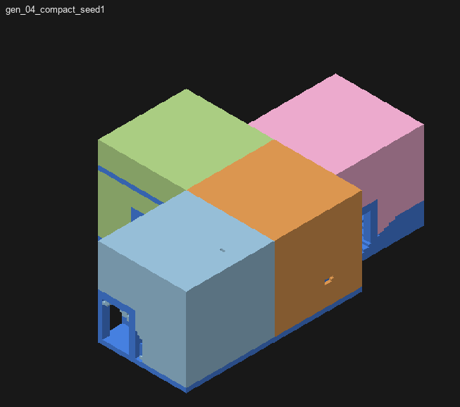 | 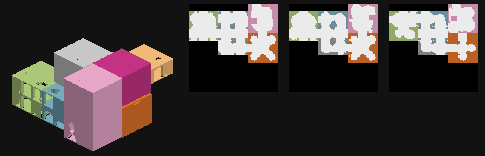 | 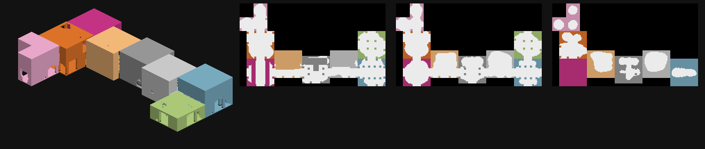 |
| 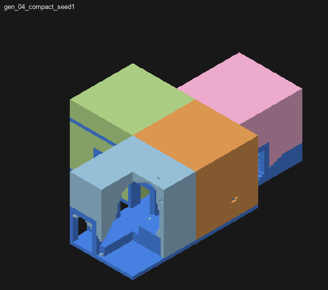 | 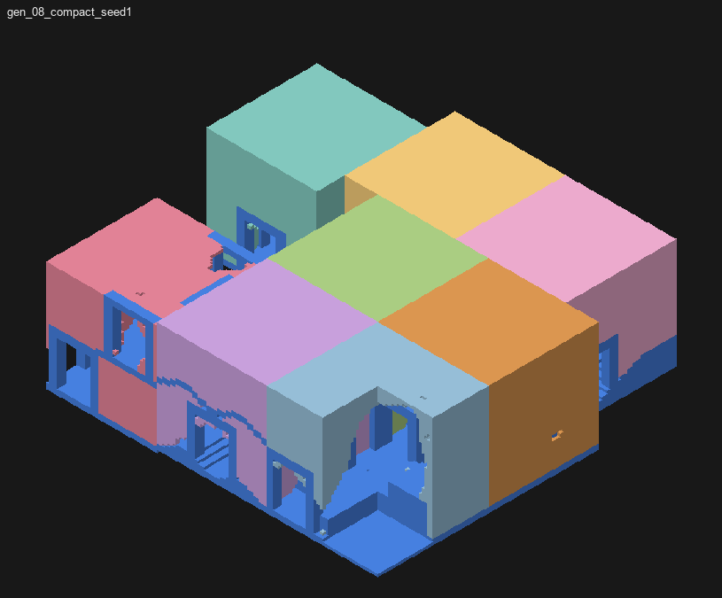 | 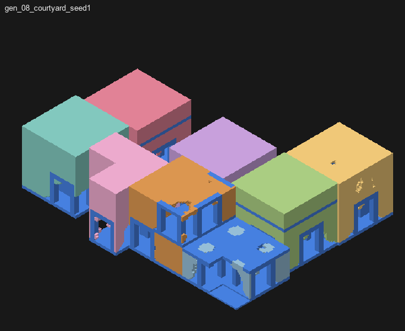 |

Nested L-plans (O4 into L5, G5 into O4) and the ramps arriving at upper floors:

| nested | nested | L1's ring ramp | G5's gallery |
|---|---|---|---|
| 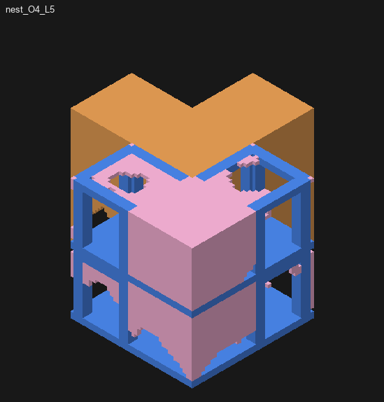 | 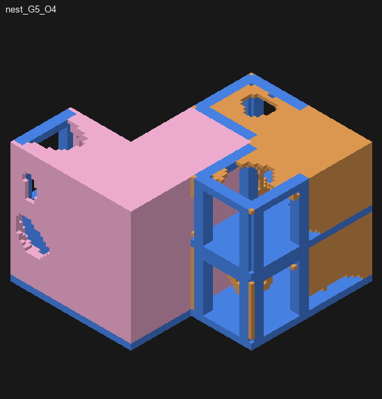 | 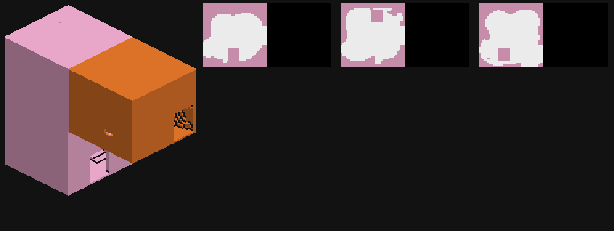 | 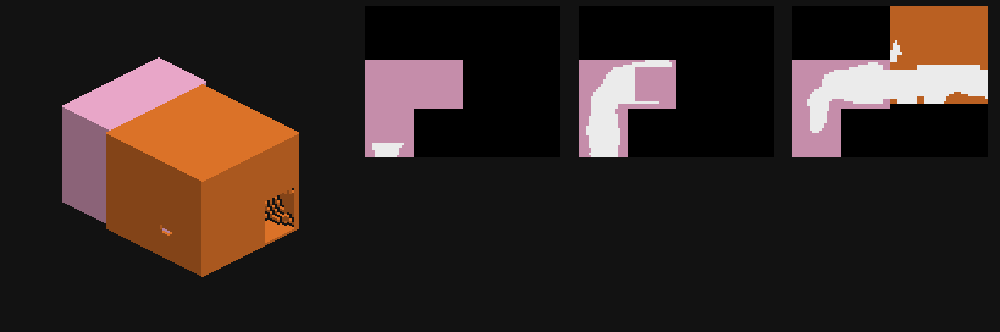 |

## 5. What was verified, and how

**Headless (no browser)**
- the real engine, run on Rhino's own Python 3.9: every recipe rebuilds its tile id from the file alone (`verify.py`), at most 21 sources and about 22,000 characters;
- `npm run check:parity`: the app's analysis agrees with the engine's on all 30 tiles (the first set and V4, masks included);
- `npm run check:v4`: sections 4.1 to 4.6 above; `check:interlock`, `check:arrange`, `check:analysis`, type check and lint stay green;
- a bug found by these checks and fixed: the Arrange joint cache handed one pair's crossings to another pair of the same tile in a 2 x 2, so a far-corner piece was reported unreachable although both its doors were open; there is now a regression test.

**In a real browser (the Chrome pane, a throwaway project, the V4 tiles loaded from their `_analysis` zips)**
- Arrange: Auto Generate with the V4 L-plans and lobbies gave 8 pieces, one nested fit, one connected mass, every piece walkable from the entrance; the Joints list shows each joint's walkable / not walkable verdict with the reason ("the floors on the two sides differ by more than one step (0.5 ft): no stair or ramp joins them");
- Analysis: the Spatial density card reads narrowest ÷ widest passage width (G5 V4: 6 ft to 9.5 ft, ratio 0.63) and shows the earlier cross-section formula separately as a legacy measurement; the variant comparison shows strength, rule ("system assumption") and fit apart for G5 V4 beside the first set's G5; the Walking rules editor (one set for Arrange and Analysis, scope stated) accepts a changed headroom, shows a restore control, and restoring returns 6.5 ft;
- exports: the Arrange one-page report built a 200 KB PNG; the Boards Analysis sheets built three 3300 x 1650 px pages (criteria, measurements, evidence; 400 to 680 KB each). The downloads were intercepted in the page and measured, not saved.

**Not verified:** running the recipes in Rhino itself (the headless engine is the same code, not Rhino), the `.3dm` export, the MP4/GIF exports of the V4 assemblies, and a person walking through the tiles in the drone tour. The G4 roof deck, the seven stray openings and L1's one-sided doors are limits of the set, listed above, not defects that were left unnoticed.

