# The V5 tile set: fifteen tiles eroded all the way through

V4 was coordinated, walkable and assembled, and it read as **built**: every tile a perfect box, framed doorways, piers, lintels, diaphragm walls and slab plates. V5 is the same family contract (a 20 x 20 ft lattice, floors at 1 / 11 / 21 ft, doorways at the shared datums, the shared walking rules, one tile per typology) written the other way round: **nothing is placed except flat floors**, the outline is a worn block with bays to nest into, and every wall, pier and arch is the foam the erosion left between voids. V4 and the first set are untouched; the V5 names carry `_v5`, the tile ids differ and the Analysis tab compares them as variants of one typology.

Outside, one scale (the corner of the block nearest the camera is not removed):
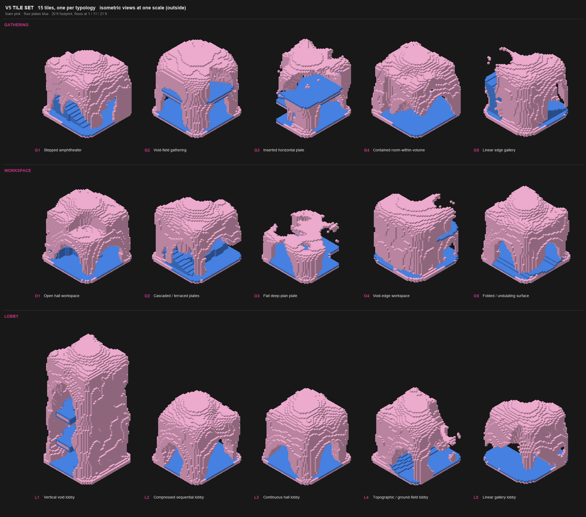

Cut away (the south-west corner removed above the ground slab; foam pink, floor plates blue where they meet a room):
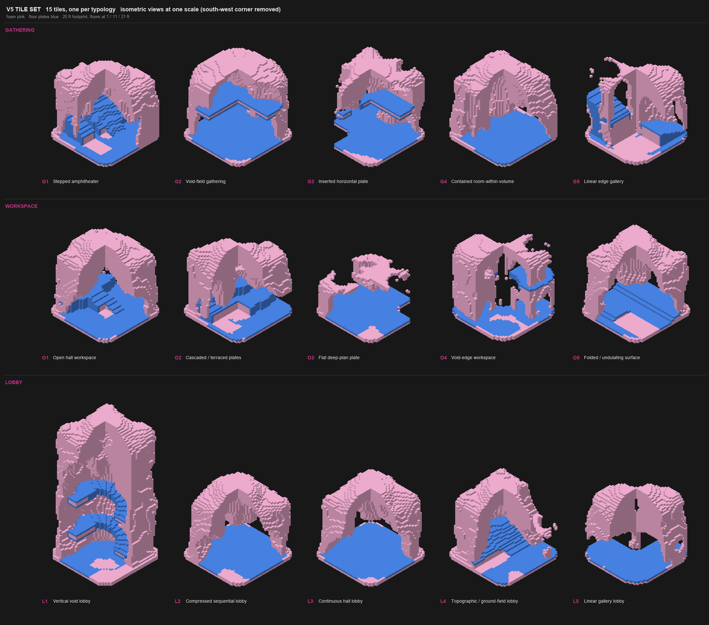

**Where things are**

| What | Where |
|---|---|
| the recipes (paste one into the engine's `recipe` panel; it ends with `RECIPE CHECK: OK`) | `engine/tiles/v5/recipes/<name>.recipe.json` |
| the kit and the tile definitions (one function per tile; the docstring is the concept) | `engine/tiles/v5/kit5.py`, `paths5.py`, `defs_g.py`, `defs_o.py`, `defs_l.py` |
| pictures per tile: outside / cut-away isometric, a walking sheet (green = floor a person can walk) | `engine/tiles/v5/recipes/previews/` |
| the app's own evaluation table | `engine/tiles/v5/EVALUATION.md` |
| assembly evidence: the check's full output and pictures of automatic assemblies | `engine/tiles/v5/assemblies/` |
| import-ready `_analysis` zips, the engine's `_reference` zips, the whole set in one zip (local, git-ignored) | `engine/tiles/v5/package/` |
| committed fixtures (voxels + the engine's analysis) | `lib/tiles/fixtures-v5/` |
| the conventions, written for the next set | `docs/RECIPE_AUTHORING.md` (the V5 section) |

```
python engine/tiles/v5/build.py [G1 O3 ...]      the real engine, headless: recipe, export, sections (seconds per tile)
python engine/tiles/v5/verify.py                 each recipe rebuilt from the file alone: RECIPE CHECK: OK, 24 sources, 32,000 characters
python engine/tiles/make_fixtures.py C:/tmp/tiles5 lib/tiles/fixtures-v5   then   npm run check:parity
npm run check:v5                                 every way Arrange can assemble them (writes engine/tiles/v5/assemblies/)
npm run boxiness                                 how much less boxy V5 is than V4
```

## 1. What was boxy, and what V5 does about it

| What read as boxy in V4 | V5 |
|---|---|
| the outline: a perfect 20 x 20 x 20 ft box, every face flat to every edge | the container is a **voxel mask**: rounded vertical edges (3 ft; 5 ft on the L-plans) and crown, a skin that only ever recedes from the ideal block by 0 to about 3 ft, a lumpy crown (up to 2 ft) with a flat 6 ft landing so a tile can still rest on another, and **bays** (a bite out of a corner, full height or only above some height) |
| framed 6 x 8 ft doorways (two jambs and a lintel as retained plates) | a bent tunnel plus a half-barrel foyer centred on the face: an irregular opening, no frame (about 9 ft wide and 10 ft high on average, 3.5 to 15 ft wide) |
| piers, lintels, diaphragm walls, poche, plate walls | none are drawn. Rooms are clusters of overlapping, leaning pods; a pillar or a wall is the foam two barrels left between them |
| slab floors with straight edges | flat-topped **height grids with lobed outlines** (a shelf of ground), ramps and ledges that follow a curve, a spiral that is part of the rock |
| ceilings that were slab undersides | no ceiling is a plate: rooms stop short of a shelf and the foam above them is domed |

The measures (`npm run boxiness`, from the committed fixtures): *envelope* is the share of the bounding box the container fills; *flat faces* the share of the six faces of the bounding box the container reaches (a box reaches all of them); *standing plate* the share of the room surface that is a retained plate or branch standing as a wall, pier, frame or lintel; *lying plate* the part that is a floor or underside (expected); *straight run* the longest straight horizontal or vertical edge on the mid sections.

| tile | V4 envelope | V4 flat faces | V4 standing plate | V4 lying plate | V4 straight run | V5 envelope | V5 flat faces | V5 standing plate | V5 lying plate | V5 straight run |
|---|---|---|---|---|---|---|---|---|---|---|
| gathering 1 stepped amphitheater | 100% | 100% | 13% | 20% | 20 ft | 73% | 35% | 11% | 20% | 9 ft |
| gathering 2 void field gathering | 100% | 100% | 54% | 25% | 20 ft | 88% | 52% | 0% | 35% | 18 ft |
| gathering 3 inserted horizontal plate | 100% | 100% | 16% | 30% | 20 ft | 77% | 42% | 2% | 33% | 12 ft |
| gathering 4 contained room within volume | 100% | 100% | 19% | 16% | 20 ft | 77% | 34% | 0% | 18% | 8 ft |
| gathering 5 linear edge gallery | 75% | 75% | 14% | 15% | 20 ft | 60% | 27% | 19% | 16% | 7 ft |
| office 1 open hall workspace | 100% | 100% | 26% | 22% | 20 ft | 75% | 34% | 7% | 22% | 12 ft |
| office 2 cascaded terraced plates | 100% | 100% | 17% | 19% | 20 ft | 69% | 33% | 9% | 21% | 8 ft |
| office 3 flat deep plan plate | 100% | 100% | 30% | 37% | 20 ft | 84% | 56% | 0% | 32% | 15 ft |
| office 4 void edge workspace | 75% | 75% | 25% | 31% | 20 ft | 64% | 30% | 1% | 28% | 10 ft |
| office 5 folded undulating work surface | 100% | 100% | 23% | 34% | 20 ft | 80% | 39% | 5% | 22% | 12 ft |
| lobby 1 vertical void lobby | 100% | 100% | 12% | 21% | 40 ft | 77% | 21% | 13% | 19% | 8 ft |
| lobby 2 compressed sequential lobby | 100% | 100% | 33% | 12% | 20 ft | 80% | 40% | 0% | 21% | 15 ft |
| lobby 3 continuous hall lobby | 100% | 100% | 29% | 17% | 20 ft | 80% | 39% | 0% | 22% | 12 ft |
| lobby 4 topographic ground field lobby | 100% | 100% | 14% | 21% | 20 ft | 70% | 33% | 6% | 23% | 8 ft |
| lobby 5 linear gallery lobby | 75% | 75% | 11% | 16% | 20 ft | 58% | 28% | 0% | 24% | 10 ft |
| **mean of 15** | 95% | 95% | 22% | 22% | 21 ft | 74% | 36% | 5% | 24% | 11 ft |

On average the block fills **74%** of its box in V5 against 95% (V4 already had three L-plans at 75%; the other twelve were 100%), the share of the box faces the block still reaches falls from 95% to **36%** (what remains flat is the doorway pads, the crown landing and the foot), and the plate surface that *stands* (the part that reads as built) falls from **22% to 5%** of the room surface; what is left is the edges of the ledges and terraces of G1, G5, O2 and L1, which are ground, not walls. The longest straight edge on the mid sections falls from 21 ft to **11 ft** (G1, G5 and L1 are under 10 ft).

## 2. The design matrix

| | Typology idea | The block (outline and bay) | Erosion logic | Floors and circulation | Interfaces |
|---|---|---|---|---|---|
| **G1** | Stepped amphitheater | rounded block; upper NE bite 8 x 8 ft above 12 ft | stage barrel, three barrels riding the seating up, a ledge pod row | contour terraces (seats) + a separate 4 ft ledge at 0.37, one floor 1.0 to 6.5 ft | -y u 10, +-x u 5, ground |
| **G2** | Void-field gathering | rounded block | a great barrel + 4 satellites per floor, joined where barrels meet | ground field 250 ft², upper field = receiving floor on a 1.6 ft shelf | four faces, both floors |
| **G3** | Inserted horizontal plate | NW corner bay 7 x 7 ft | low barrels under, hall over, tall hall beyond the free lobed edge | ground 223 ft²; shelf at 11 ft = receiving floor | four faces ground, three on the shelf |
| **G4** | Contained room-within-volume | rounded block | a kernel of foam in a wrapping cave; a chamber carved inside | forecourt, side passages, the room behind a throat | -y, +-x |
| **G5** | Linear edge gallery | L-plan, NE bay 10 x 10 ft, rounded | a ledge of ground with a pod row above it | one floor 1.0 to 11.5 ft, slope 0.37 | +x ground (sloped tunnel), -y at 3 ft, -x at 10 ft, +y at 11 ft |
| **O1** | Open hall workspace | upper SW bite 8 x 8 ft above 14.5 ft | three overlapping barrels; the pillars are foam between them | platform at 4 ft + ramp, one floor 207 ft² | -y, +-x |
| **O2** | Cascaded / terraced plates | upper NE bite 9 x 11 ft above 11.5 ft | a cave riding two lobed shelves up | ground, shelf 2.5 ft, shelf 5 ft, ramp | -y, +-x |
| **O3** | Flat deep-plan plate | 10 ft storey; SE bay 6 x 6 ft | four barrels, pillars between, skylights as shafts | one level, 206 ft² | four faces |
| **O4** | Void-edge workspace | L-plan, NE bay 10 x 10 ft | floors wrap the outer corner; a double-height void at the inner corner | main floor 117 ft²; upper floors = receiving | arm ends and bay walls, both floors |
| **O5** | Folded / undulating surface | rounded block | nine barrels, one per fold station | folded floor, slopes 0.35, 238 ft² | four faces on the valley line |
| **L1** | Vertical void lobby | 20 x 20 x **40** ft | a chimney + a two-turn spiral ledge | one floor 1.0 to 21.5 ft, slope 0.27 | west, ground / 11 / 21 ft |
| **L2** | Compressed sequential lobby | rounded block | three chambers and two slots | one floor through all three | four faces |
| **L3** | Continuous hall lobby | rounded block | a nave of double barrels, aisles behind perforated foam | one hall, 212 ft² | four faces |
| **L4** | Topographic / ground-field lobby | lower SE bite 8 x 8 ft above 9 ft | one height field and a vault that follows it | ground 1 to 5.5 ft, slope 0.45 | -y, +-x |
| **L5** | Linear gallery lobby | L-plan, NE bay 10 x 10 ft | beads of barrels, two throats | one floor along the L, 220 ft² | arm ends, far walls, bay walls |

**The interlock design.** Bays are placed on different corners and at different sizes on purpose (a full-height 10 x 10 ft bay on G5, O4 and L5; 7 x 7 on G3; upper bites of 8 x 8, 9 x 11 on G1, O1, O2, L4; a 6 x 6 on O3), and every tile has convex corners rounded wider than any bay's fillet and a skin that never bulges, so Arrange's cell-level collision policy lets them nest where the lattice puts them. The crown landing and the foot are flat, so tiles also stack. The tests are in section 4.

## 3. The tiles, one by one

**G1, Stepped amphitheater** (`gathering_1_stepped_amphitheater_v5`). *Intent:* a bowl read in section. *Eroded:* a cavern with a flat stage, seating that is a set of **contour terraces** (1 ft risers that wander in arcs round the stage and stop short of the east door; they are seats, not steps) and a rear walk 5 ft up; the roof rides the seating up. *Circulation:* the way up is a **separate ledge** of ground along the west wall, 4 ft wide, rising 5 ft at 0.37; the stage, the ledge and the rear walk are one walkable floor (1.0 to 6.5 ft). *Block and interlock:* the upper north-east corner is bitten away (8 x 8 ft above 12 ft): a bay a neighbour can fill. *Doors:* south and both sides at the ground datum.
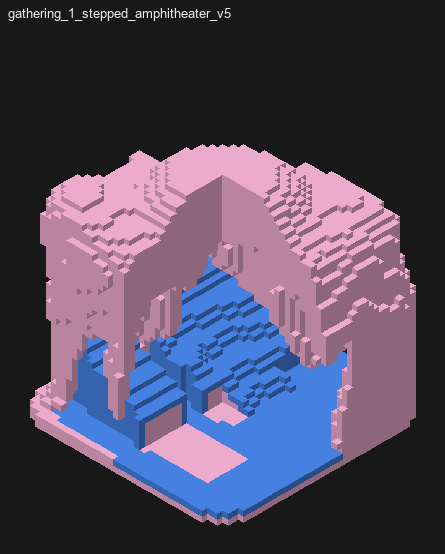 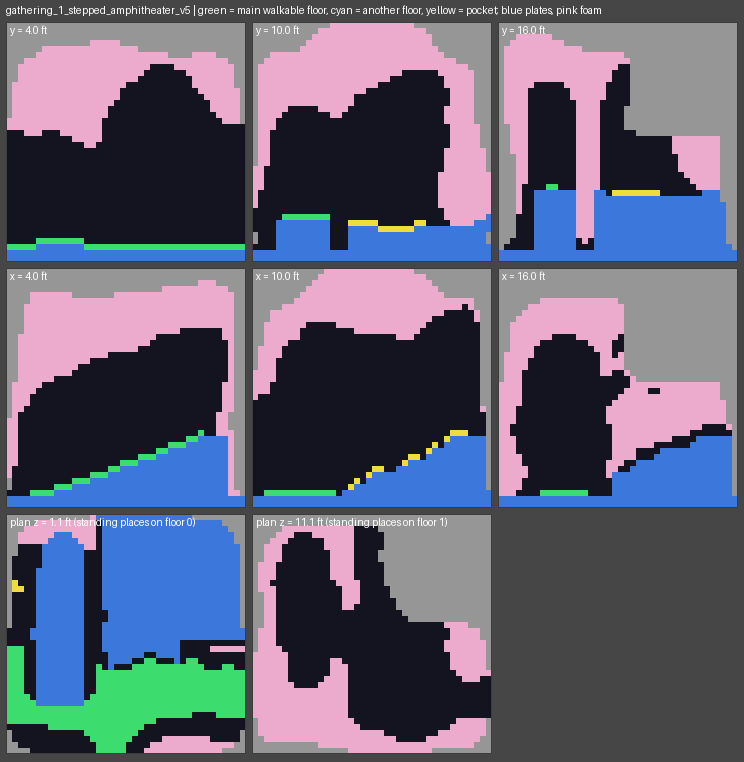

**G2, Void-field gathering** (`gathering_2_void_field_gathering_v5`). *Intent:* a field of separate rooms, not a hall. *Eroded:* a great barrel and four satellites, each its own cave, joined where two barrels meet (the foam between them is whatever the erosion left, 1.5 to 3 ft); above them a second, different field on a **thick shelf of ground** (1.6 ft, lobed edge) so the ceilings below are domed foam. *Circulation:* the ground field is one floor of 250 ft²; the upper field is a **receiving floor** (no stair of its own). *Doors:* all four faces, both floors.
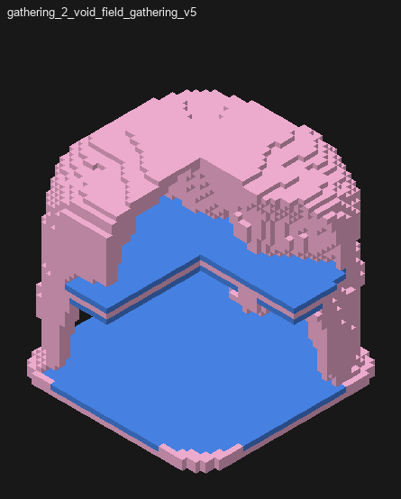 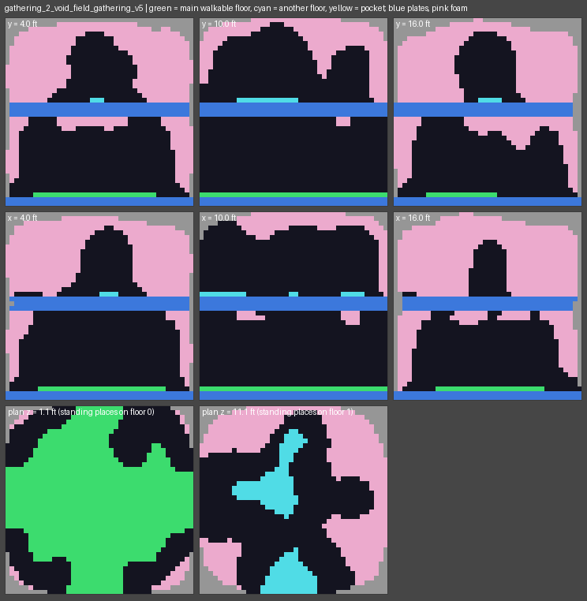

**G3, Inserted horizontal plate** (`gathering_3_inserted_horizontal_plate_v5`). *Intent:* one shelf pushed into a tall cave. *Eroded:* a shelf of ground at 11 ft that grows out of the south wall and ends in a free, lobed edge a little past the middle, a low domed room under it, a hall over it and a double-height hall beyond its edge; the north-west corner is a bay (7 x 7 ft, full height). *Circulation:* the ground floor is 223 ft²; the shelf is a **receiving floor**. *Doors:* four at the ground, three on the shelf.
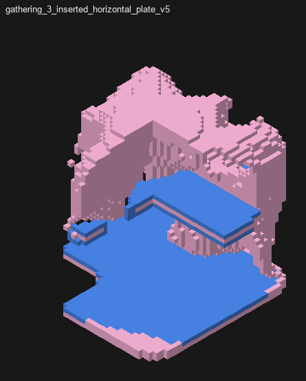 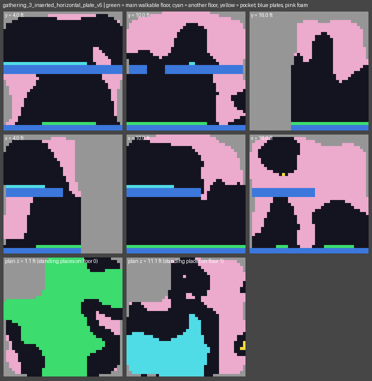

**G4, Contained room-within-volume** (`gathering_4_contained_room_within_volume_v5`). *Intent:* a room inside a larger space. *Eroded:* a **kernel of foam** stands in a tall cave, a chamber is carved in it and its walls are only the 2 to 3 ft the erosion left; the cave wraps the kernel and goes up over it into one hall. *Circulation:* forecourt, side passages and the room behind a throat. *Doors:* south and both sides.
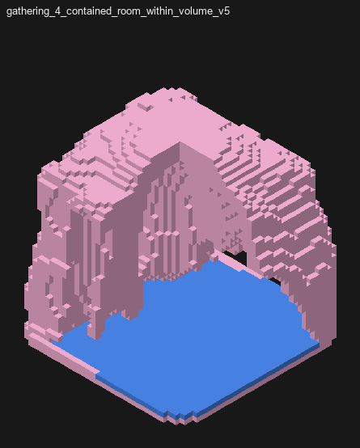 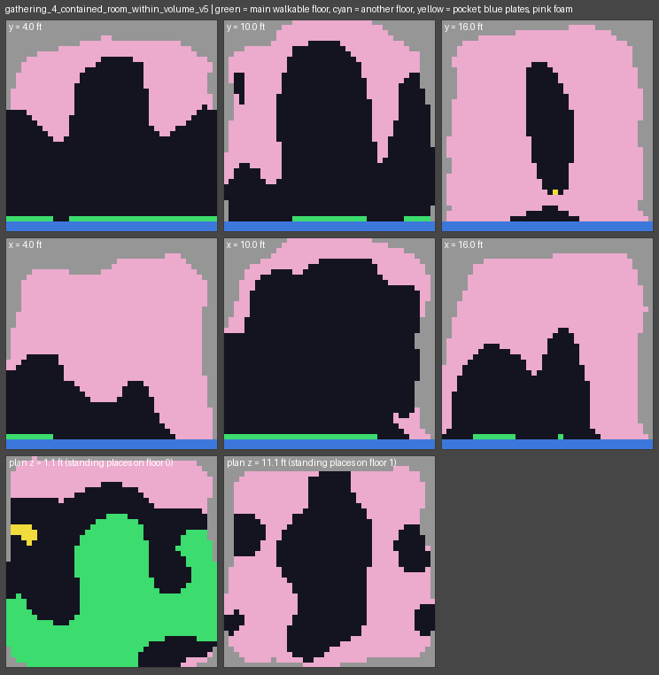

**G5, Linear edge gallery** (`gathering_5_linear_edge_gallery_v5`). *Intent:* an edge you walk along. *Eroded:* an L-plan block (the north-east corner is a rounded 10 x 10 ft bay) with one 6 to 7 ft **ledge of ground** that climbs from the ground to the upper datum along both arms (about 0.37); headroom is a row of pods that start at the ledge's surface. *Circulation:* one walkable floor from 1.0 to 11.5 ft. *Doors:* four, along the ledge: east at the ground (the tunnel tilts with the ledge), south at about 3 ft and west at about 10 ft where the ledge passes those walls, north at the upper floor (11 ft). The ledge is why other tiles can stand at 11 ft.
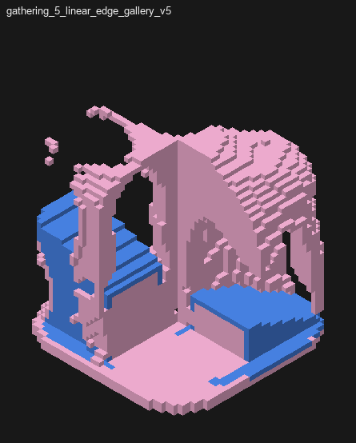 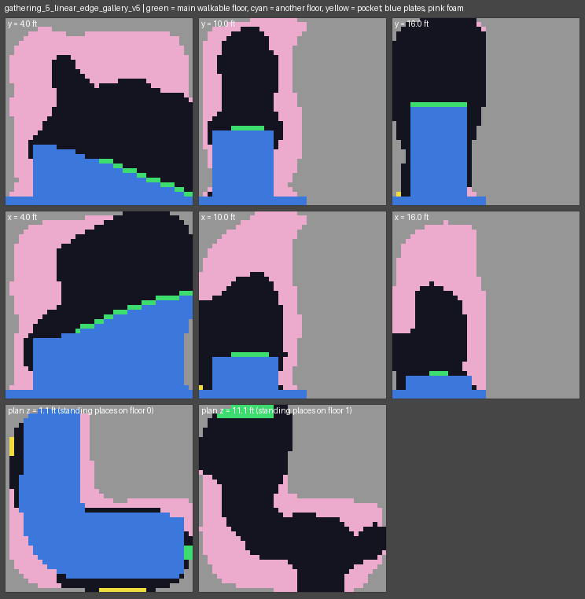

**O1, Open hall workspace** (`office_1_open_hall_workspace_v5`). *Intent:* one hall you can see across. *Eroded:* three overlapping barrels; the spurs and pillars that stand in it are the foam between them (nothing is placed); a raised platform of ground along the north side (3 ft up, lobed edge) reached by a natural ramp up the middle. The upper south-west corner is a bay. *Circulation:* one walkable floor, 207 ft², rising to 4.5 ft. *Doors:* south and both sides.
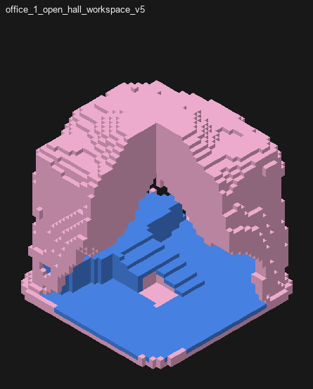 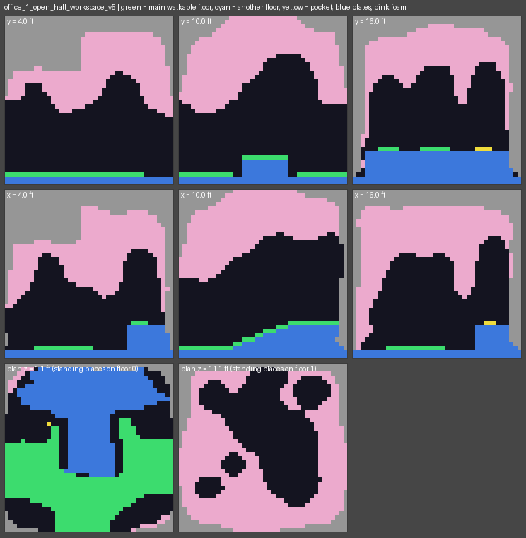

**O2, Cascaded / terraced plates** (`office_2_cascaded_terraced_plates_v5`). *Intent:* floors stepping up like terraces of travertine. *Eroded:* ground, a shelf 2.5 ft up and a shelf 5 ft up (each lobed, deep enough to work on, the drops too high to step), one ramp of ground along the west wall that meets each shelf level, one tall cave riding the cascade up; the upper north-east of the block is a terrace of its own (9 x 11 ft above 11.5 ft). *Doors:* south and both sides.
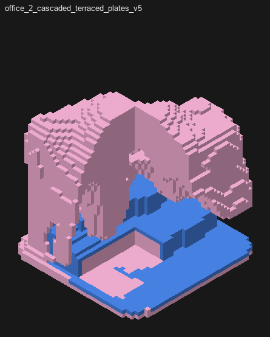 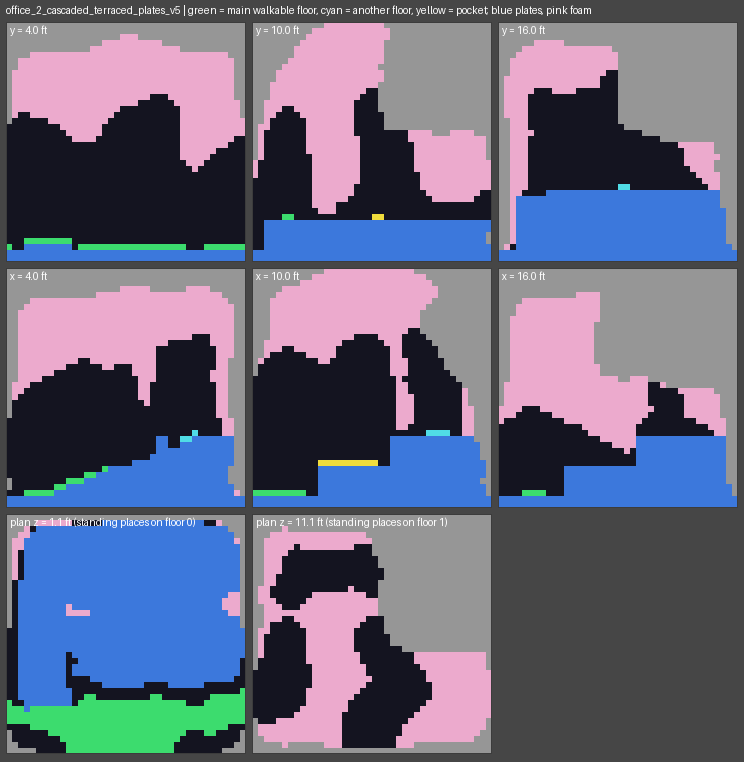

**O3, Flat deep-plan plate** (`office_3_flat_deep_plan_plate_v5`). *Intent:* the tile is a plate: one 10 ft storey. *Eroded:* a wide low cave of four overlapping barrels under a thin worn crust, the foam between them standing as pillars, four skylights that are simply shafts that reached the sky; the south-east corner is a bay. *Circulation:* one level, 206 ft². *Doors:* all four faces.
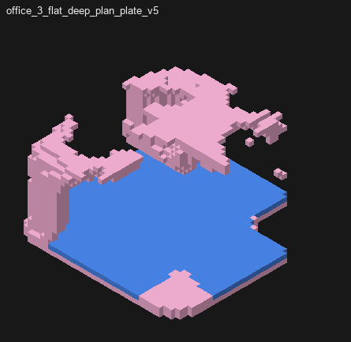 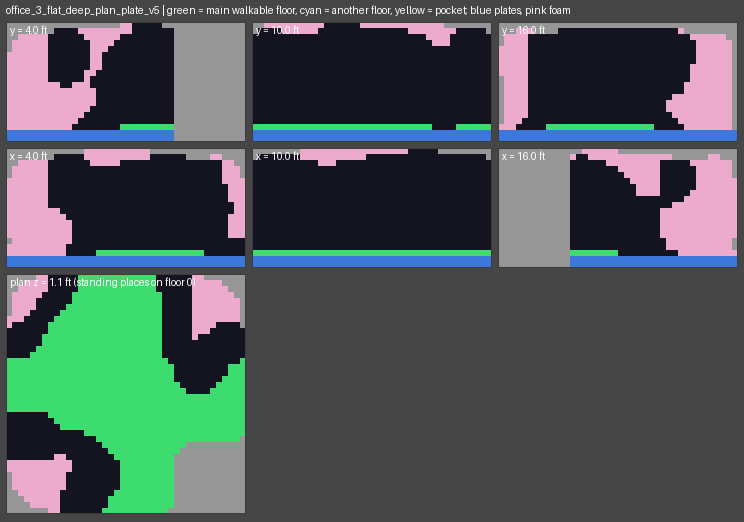

**O4, Void-edge workspace** (`office_4_void_edge_workspace_v5`). *Intent:* workspace on the edge of a void. *Eroded:* an L-plan block whose two floors **wrap the outside of the L** (a shelf along both arms and round the outer corner, lobed inner edge) and look over one double-height void at the inner corner; the bay is the second void. *Circulation:* the main floor is 117 ft² (the ground arms); the upper floors are **receiving floors**. *Doors:* both floors at each arm's end and through the two walls of the bay.
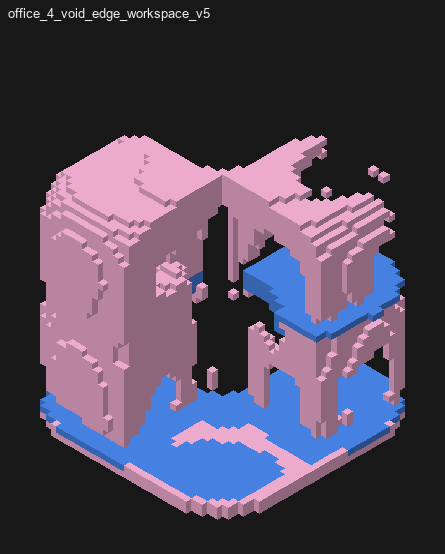 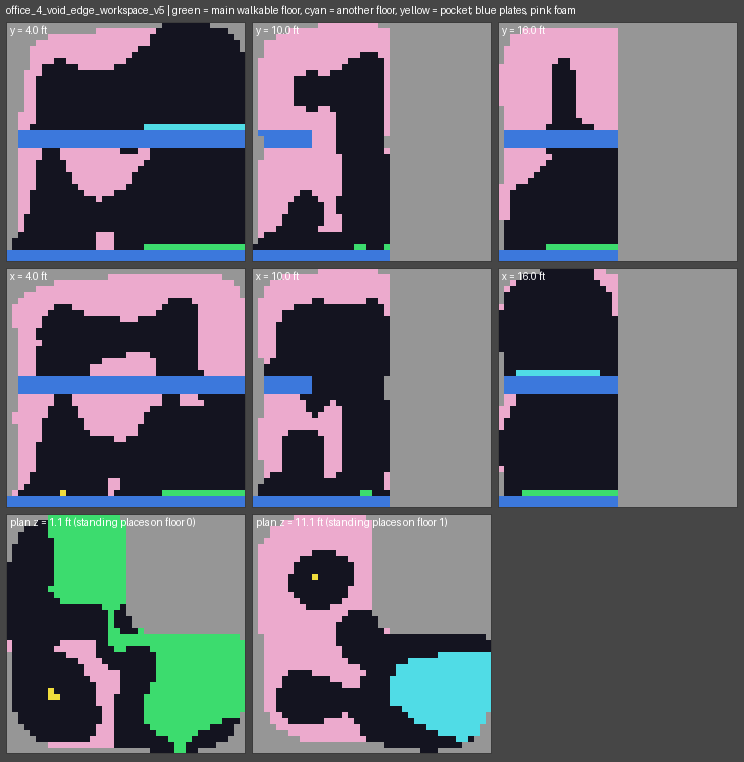

**O5, Folded / undulating work surface** (`office_5_folded_undulating_work_surface_v5`). *Intent:* floor and roof are the same fold. *Eroded:* a floor of soft folds (flat valley and ridge benches joined by slopes of 0.35, a 1.2 ft rise every 5 ft) and a cave over it whose vault follows the folds, nine barrels, one per fold station. *Circulation:* one walkable floor, 238 ft². *Doors:* the four faces on the valley line.
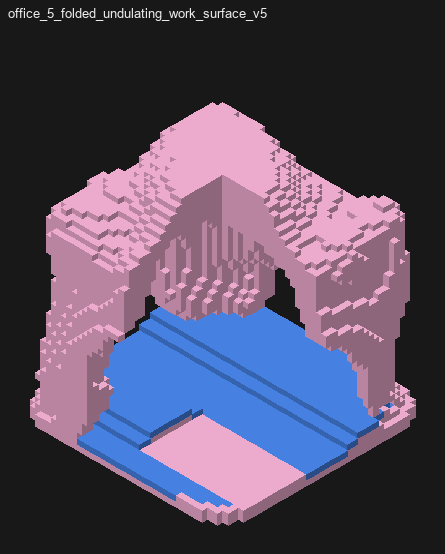 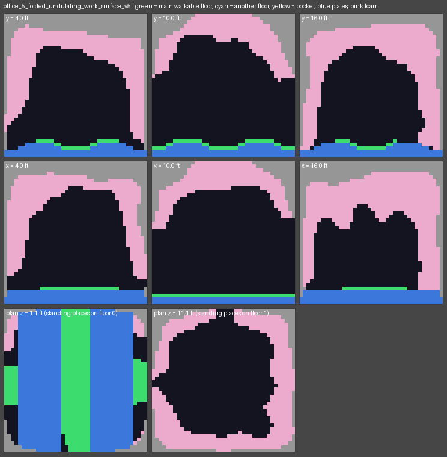

**L1, Vertical void lobby** (`lobby_1_vertical_void_lobby_v5`). *Intent:* arrival and the rise through the building are one thing. 20 x 20 x **40** ft. *Eroded:* one tall chimney of void and, winding round it twice, a **spiral ledge** of ground (3.6 to 4.4 ft wide, 0.27 slope) that is part of the rock; the ledge passes the west wall at the ground, at 11 and at 21 ft, so the doors stack in one place. *Circulation:* one walkable floor from 1.0 to 21.5 ft. *Doors:* west, at the three datums. It is the set's strongest producer of vertical circulation.
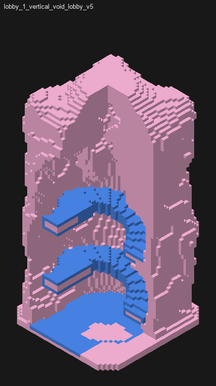 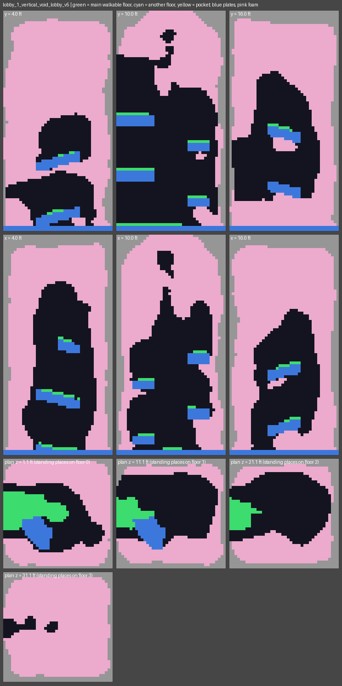

**L2, Compressed sequential lobby** (`lobby_2_compressed_sequential_lobby_v5`). *Intent:* low and narrow, high and wide, narrow, wide. *Eroded:* three tall chambers one after another, joined by **slots** that are simply the thinnest places in the foam between them (3.8 ft wide, 9 ft high); no wall is drawn. *Circulation:* one walkable floor straight through. *Doors:* all four faces.
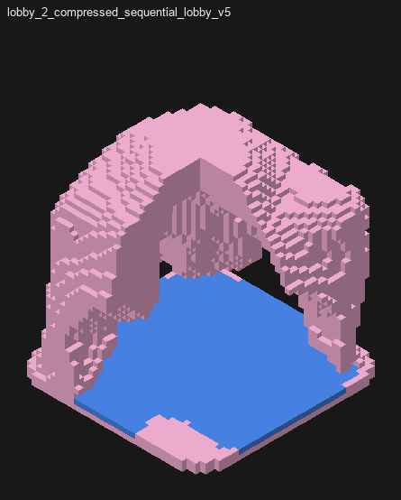 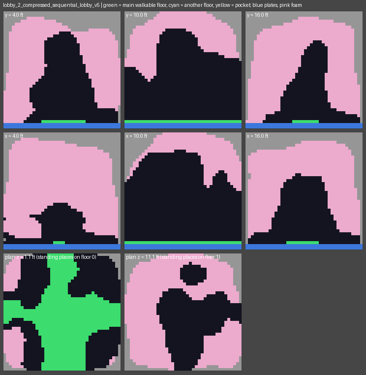

**L3, Continuous hall lobby** (`lobby_3_continuous_hall_lobby_v5`). *Intent:* a hall whose walls are a rhythm. *Eroded:* a long nave of three double barrels with a low aisle on each side separated from it by foam that the erosion has perforated into piers and arches; nothing is built. *Circulation:* one hall end to end and through the aisles, 212 ft². *Doors:* all four faces.
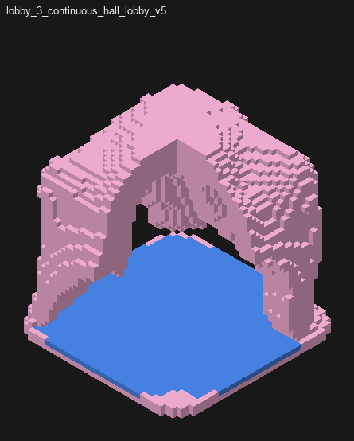 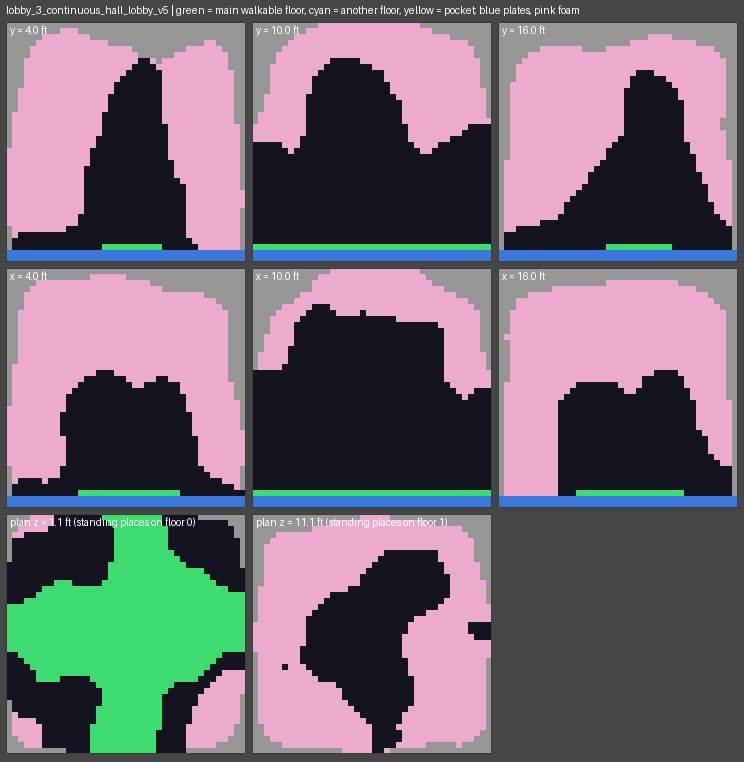

**L4, Topographic / ground-field lobby** (`lobby_4_topographic_ground_field_lobby_v5`). *Intent:* the floor is a landscape, the roof its counter-landscape. *Eroded:* one height-field of ground (a swell and two mounds from 1 ft to about 5.5 ft, never steeper than 0.45) and a vault that follows it up; the upper south-east of the block is a bay. *Doors:* south and both sides.
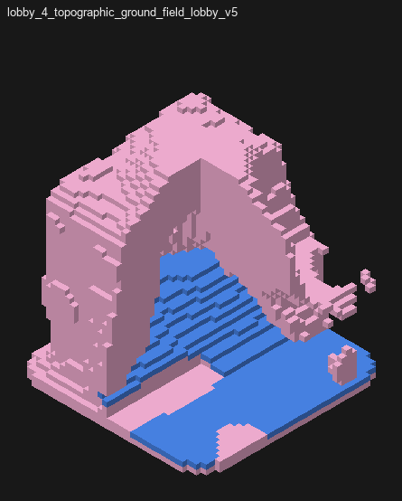 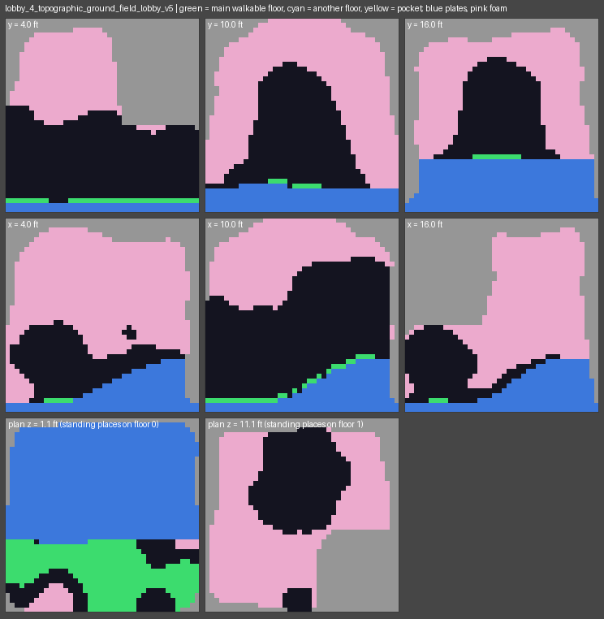

**L5, Linear gallery lobby** (`lobby_5_linear_gallery_lobby_v5`). *Intent:* a gallery to arrive by, chambers to stop in. *Eroded:* an L-plan block; beads of tall barrels at the two arm ends and the corner, two throats between them; the notch is a rounded bay. *Circulation:* one walkable floor along the whole L, 220 ft². *Doors:* the end of each arm, the far wall of each arm and both walls of the bay.
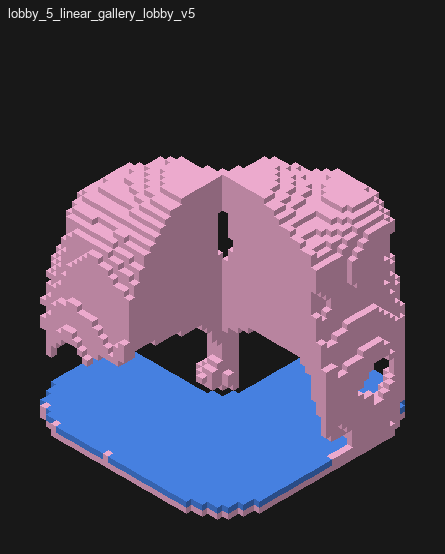 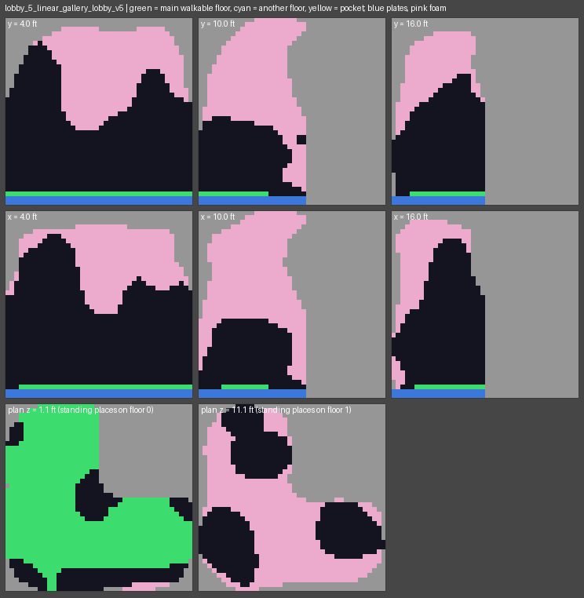

## 4. Compatibility results (`npm run check:v5`)

Every number is read by the app's own Arrange code from the committed fixtures. A piece counts only if it is attached, collision-free under the occupancy policy and its main floor is reachable on foot from the entrance. No walking or collision rule is relaxed. The full output is `engine/tiles/v5/assemblies/results.txt`.

### 4.1 Every pair (225 ordered pairs)
The best placement of the second tile (column) against the first (row) over eight orientations; **W** = a walkable joint that joins the two main floors.

```
      G1  G2  G3  G4  G5  O1  O2  O3  O4  O5  L1  L2  L3  L4  L5 
  G1  W   W   W   W   W   W   W   W   W   W   W   W   W   W   W  
  G2  W   W   W   W   W   W   W   W   W   W   W   W   W   W   W  
  G3  W   W   W   W   W   W   W   W   W   W   W   W   W   W   W  
  G4  W   W   W   W   W   W   W   W   W   W   W   W   W   W   W  
  G5  W   W   W   W   W   W   W   W   W   W   W   W   W   W   W  
  O1  W   W   W   W   W   W   W   W   W   W   W   W   W   W   W  
  O2  W   W   W   W   W   W   W   W   W   W   W   W   W   W   W  
  O3  W   W   W   W   W   W   W   W   W   W   W   W   W   W   W  
  O4  W   W   W   W   W   W   W   W   W   W   W   W   W   W   W  
  O5  W   W   W   W   W   W   W   W   W   W   W   W   W   W   W  
  L1  .   .   .   .   .   .   .   .   .   .   .   .   .   .   .  
  L2  W   W   W   W   W   W   W   W   W   W   W   W   W   W   W  
  L3  W   W   W   W   W   W   W   W   W   W   W   W   W   W   W  
  L4  W   W   W   W   W   W   W   W   W   W   W   W   W   W   W  
  L5  W   W   W   W   W   W   W   W   W   W   W   W   W   W   W  
```

- 210 of 225 ordered pairs (93%) have a walkable joint in their best placement  (16 s)
- counted either way round: 119 of 120 unordered pairs (99%) can be joined on foot

### 4.2 Repeat, mirror and shift of one tile, 2, 4 and 8 copies
**V** = valid (attached, no collision, every copy reachable on foot); **a** = attached and collision-free but at least one copy is not reachable; **X** = detached or colliding.

| tile | repeat 2 | repeat 4 | repeat 8 | mirror 2 | mirror 4 | mirror 8 | shift 2 | shift 4 | shift 8 |
|---|---|---|---|---|---|---|---|---|---|
| G1 | V | a | a | V | a | a | a | a | a |
| G2 | V | V | a | V | V | a | a | a | a |
| G3 | V | V | a | V | V | a | a | a | a |
| G4 | V | a | a | V | a | a | a | a | a |
| G5 | a | a | a | V | V | a | X | a | a |
| O1 | V | a | a | V | a | a | a | a | a |
| O2 | V | a | a | V | a | a | a | a | a |
| O3 | V | V | a | V | V | a | a | a | a |
| O4 | a | a | a | V | V | a | X | a | a |
| O5 | V | V | a | V | V | a | a | a | a |
| L1 | a | a | a | a | a | a | a | a | a |
| L2 | V | V | a | V | V | a | a | a | a |
| L3 | V | V | a | V | V | a | a | a | a |
| L4 | V | a | a | V | a | a | a | a | a |
| L5 | V | V | a | V | V | a | X | a | a |

14 of 15 tiles make at least one valid repeat / mirror / shift aggregation by themselves. L1 is the one tile with no valid line: all its doors are on the west face, so two copies in a row never meet door to door (the pair search turns it and finds 13 of 14 partners). **Read the 8-copy columns with care**: stacking is physical (the crown landing and the foot are flat and touch), but a tile has no way up through its own roof, so an upper layer is never reachable, and with a worn crown some stacks only touch at the landing and are reported detached (X) when the neighbouring copies do not line up.

### 4.3 Nesting: the L-plan tiles into each other's bay (every orientation, offsets of 10 ft)
- G5 + G5: 28 collision-free nested placements, 0 of them with a walkable joint and both pieces reachable
- G5 + O4: 28 collision-free nested placements, 4 of them with a walkable joint and both pieces reachable
- G5 + L5: 28 collision-free nested placements, 4 of them with a walkable joint and both pieces reachable
- O4 + G5: 28 collision-free nested placements, 2 of them with a walkable joint and both pieces reachable
- O4 + O4: 28 collision-free nested placements, 10 of them with a walkable joint and both pieces reachable
- O4 + L5: 28 collision-free nested placements, 12 of them with a walkable joint and both pieces reachable
- L5 + G5: 28 collision-free nested placements, 2 of them with a walkable joint and both pieces reachable
- L5 + O4: 28 collision-free nested placements, 10 of them with a walkable joint and both pieces reachable
- L5 + L5: 28 collision-free nested placements, 12 of them with a walkable joint and both pieces reachable

The bays are 10 x 10 ft with 2.5 ft fillets; the rounded corners are 5 ft. Every pair nests without collision (28 to 29 placements each). G5 into G5 nests but has no walkable joint: both ledges pass the notch at 8.5 to 9 ft and the two bay walls do not meet at one floor.

### 4.4 Vertical meetings across a ramp
- the ring ramp of L1: 13 of 14 other tiles stand at an upper level of the host and are reached on foot (G1 G2 G3 G4 O1 O2 O3 O4 O5 L2 L3 L4 L5)  [364 walkable raised placements checked]
- the gallery ramp of G5: 3 of 14 other tiles stand at an upper level of the host and are reached on foot (O3 O4 L5)  [12 walkable raised placements checked]

### 4.5 Receiving floors
- G2: 84% of its floor on its main floor alone; 91% best beside L1
- G3: 70% of its floor on its main floor alone; 100% best beside L1
- O2: 86% of its floor on its main floor alone; 86% best beside (alone)
- (O2: its other floor is not a receiving floor by design)
- O4: 70% of its floor on its main floor alone; 100% best beside L1

### 4.6 Auto Generate over the whole bank (five shapes, 2, 4 and 8 pieces, three seeds = 45 runs)
```
45 of 45 runs valid; 11 nested fits found; 30 runs mixed all three categories
how often each tile was placed (in all runs / in valid runs):
G1 20/20   G2 23/23   G3 23/23   G4 6/6   G5 0/0   O1 13/13   O2 7/7   O3 18/18   O4 8/8   O5 34/34   L1 5/5   L2 18/18   L3 10/10   L4 8/8   L5 17/17
G5 was not chosen by the objective in any run; its best two-piece assembly with each other tile is valid for 13 of 14 hosts
```

**G5 is the one tile Auto Generate never chooses by itself** (0 of 45 runs): it is the lowest-density tile (60% of its box, the roomiest bay), so the generator's compactness and tuck terms rank its candidates a little below everyone else's, and with four doors it has far fewer candidate placements (about 960 against 7,700 for O4 across all hosts). It is not unassemblable: the check builds the best two-piece assembly of G5 with every other tile and it is valid (attached, no collision, both reachable on foot) for 13 of the 14 hosts (the exception is L1 as host, which has west-only doors). A real Arrange user gets G5 by placing it by hand or with Suggest next; it is a candidate for a few more doors in a later round.

Representative automatic assemblies (colour = piece; the second row removes a 10 ft corner at the south-west):

| 4 pieces | 8 pieces | 8 pieces |
|---|---|---|
| 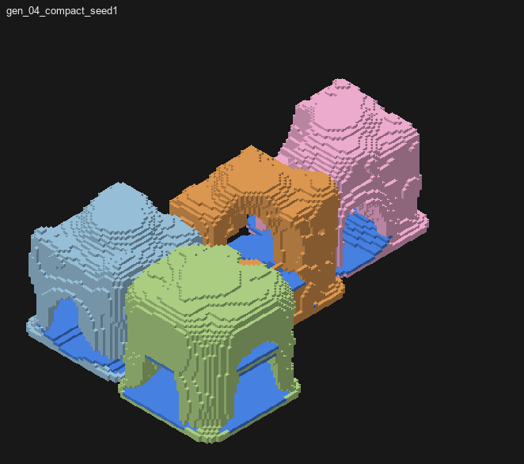 | 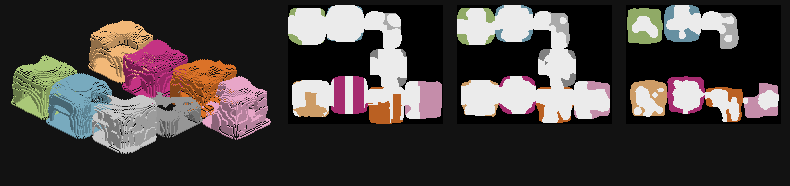 | 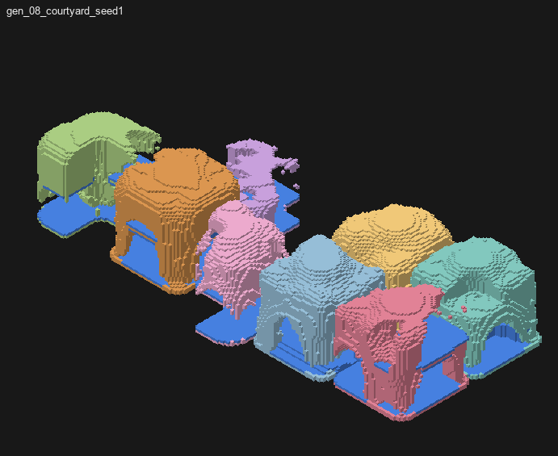 |
| 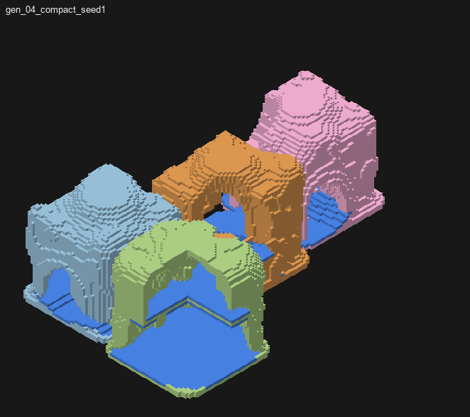 | 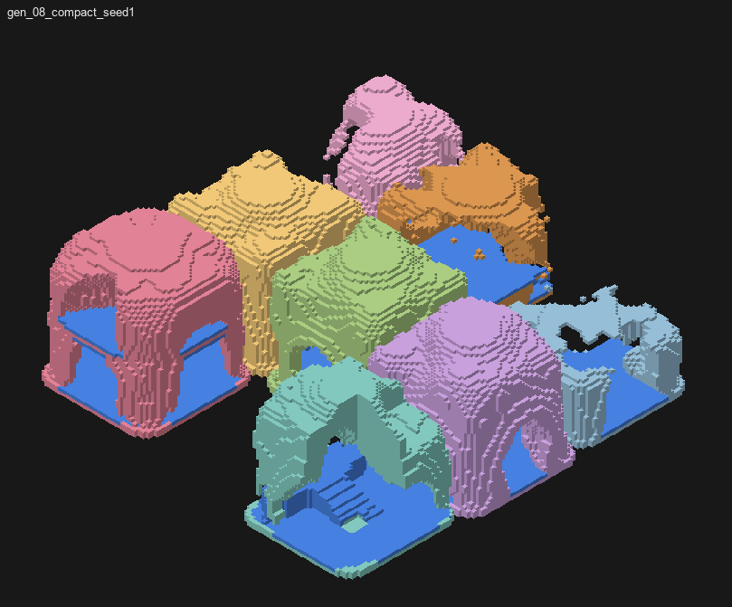 | 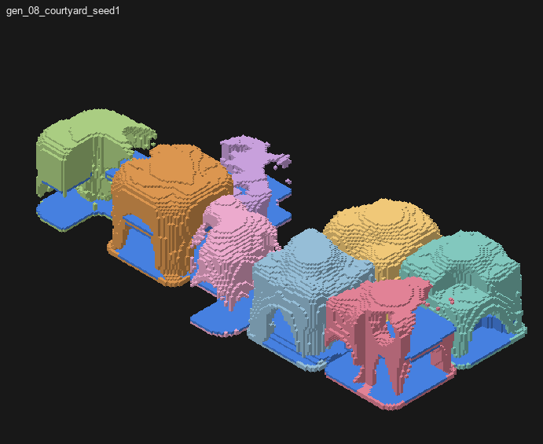 |

Nested L-plans:

| | | |
|---|---|---|
| 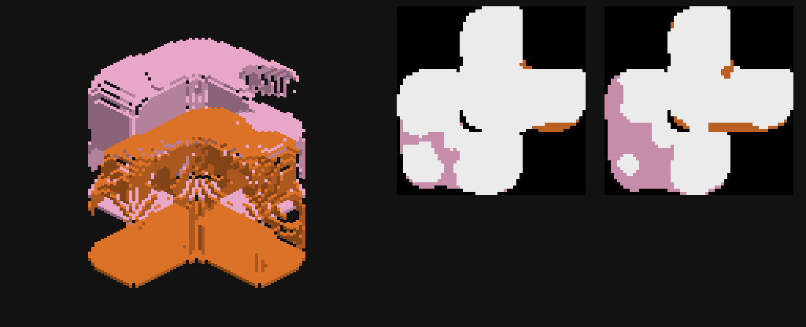 | 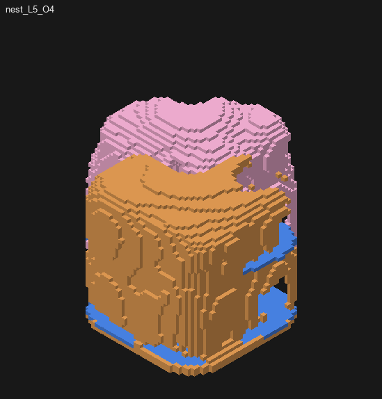 | 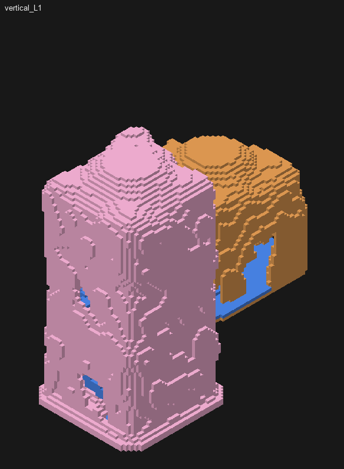 |

## 5. Evaluation

### 5.1 Floor, circulation and usability (computed by the app)
| tile | size ft | floor reached on foot from a ground opening | real floors (zones) | levels reached | void reached | too tight to use |
|---|---|---|---|---|---|---|
| G1 | 20 x 20 x 20 | 44% of 299 ft² | 1 (main 130 ft²) | 1/1 | 49% | 169 ft² |
| G2 | 20 x 20 x 20 | 51% of 494 ft² | 3 (main 250 ft²) | 1/3 | 54% | 196 ft² |
| G3 | 20 x 20 x 20 | 47% of 477 ft² | 2 (main 223 ft²) | 1/3 | 54% | 159 ft² |
| G4 | 20 x 20 x 20 | 58% of 291 ft² | 1 (main 169 ft²) | 1/1 | 66% | 122 ft² |
| G5 | 20 x 20 x 20 | 53% of 209 ft² | 1 (main 110 ft²) | 1/1 | 51% | 99 ft² |
| O1 | 20 x 20 x 20 | 61% of 338 ft² | 1 (main 207 ft²) | 2/2 | 66% | 132 ft² |
| O2 | 20 x 20 x 20 | 33% of 265 ft² | 2 (main 88 ft²) | 3/4 | 39% | 162 ft² |
| O3 | 20 x 20 x 10 | 72% of 284 ft² | 1 (main 206 ft²) | 1/2 | 75% | 78 ft² |
| O4 | 20 x 20 x 20 | 33% of 350 ft² | 2 (main 117 ft²) | 1/4 | 38% | 184 ft² |
| O5 | 20 x 20 x 20 | 75% of 317 ft² | 1 (main 238 ft²) | 1/1 | 83% | 79 ft² |
| L1 | 20 x 20 x 40 | 58% of 475 ft² | 1 (main 275 ft²) | 3/3 | 56% | 200 ft² |
| L2 | 20 x 20 x 20 | 61% of 292 ft² | 1 (main 178 ft²) | 1/1 | 71% | 115 ft² |
| L3 | 20 x 20 x 20 | 70% of 304 ft² | 1 (main 212 ft²) | 1/1 | 78% | 92 ft² |
| L4 | 20 x 20 x 20 | 57% of 262 ft² | 1 (main 150 ft²) | 1/1 | 61% | 112 ft² |
| L5 | 20 x 20 x 20 | 79% of 278 ft² | 1 (main 220 ft²) | 1/1 | 85% | 58 ft² |

The share of the floor that passes the walking rules averages 56% (V4: 54%), so eroding the rooms did not cost walkable floor; the main floor of every tile is 88 to 275 ft² and joins its doorways. The twelve descriptors are in `engine/tiles/v5/EVALUATION.md`.

### 5.2 V5 beside V4 as variants of one typology (the Analysis tab's variant comparison)
```
  stepped amphitheater               tradeoff       usable stepped_amphitheater V4 51% / stepped_amphitheater_v5 44%
  void field gathering               tradeoff       usable void_field_gathering V4 38% / void_field_gathering_v5 51%
  inserted horizontal plate          insufficient   usable inserted_horizontal_plate V4 49% / inserted_horizontal_plate_v5 47%
  contained room within volume       insufficient   usable contained_room_within_volume V4 39% / contained_room_within_volume_v5 58%
  linear edge gallery                tradeoff       usable linear_edge_gallery V4 51% / linear_edge_gallery_v5 53%
  open hall workspace                tradeoff       usable open_hall_workspace V4 51% / open_hall_workspace_v5 61%
  cascaded terraced plates           tradeoff       usable cascaded_terraced_plates V4 59% / cascaded_terraced_plates_v5 33%
  flat deep plan plate               pick         pick: office_3_flat_deep_plan_plate_v5  usable flat_deep_plan_plate V4 63% / flat_deep_plan_plate_v5 72%
  void edge workspace                tie            usable void_edge_workspace V4 33% / void_edge_workspace_v5 33%
  folded undulating work surface     insufficient   usable folded_undulating_work_surface V4 77% / folded_undulating_work_surface_v5 75%
  vertical void lobby                pick         pick: lobby_1_vertical_void_lobby_v4  usable vertical_void_lobby V4 56% / vertical_void_lobby_v5 58%
  compressed sequential lobby        tradeoff       usable compressed_sequential_lobby V4 56% / compressed_sequential_lobby_v5 61%
  continuous hall lobby              tradeoff       usable continuous_hall_lobby V4 56% / continuous_hall_lobby_v5 70%
  topographic ground field lobby     tradeoff       usable topographic_ground_field_lobby V4 68% / topographic_ground_field_lobby_v5 57%
  linear gallery lobby               pick         pick: lobby_5_linear_gallery_lobby_v5  usable linear_gallery_lobby V4 61% / linear_gallery_lobby_v5 79%
  verdicts: tradeoff 8, insufficient 3, pick 3, tie 1
```

### 5.3 Print and support checks (diagnostics only)
| tile | One piece | Wall thickness | Plates joined to the body | Overhangs | Contact with the print bed |
|---|---|---|---|---|---|
| G1 | warn: 2 separate foam pieces, 0.1 ft³ outside the main body (specks) | ok | ok | warn: 19% of the foam surface faces down over void (300 ft²); expect s | ok |
| G2 | warn: 3 separate foam pieces, 0.3 ft³ outside the main body (specks) | ok | ok | warn: 26% of the foam surface faces down over void (603 ft²); expect s | ok |
| G3 | warn: 15 separate foam pieces, 2.0 ft³ outside the main body (specks) | ok | ok | warn: 23% of the foam surface faces down over void (444 ft²); expect s | ok |
| G4 | warn: 5 separate foam pieces, 0.5 ft³ outside the main body (specks) | ok | ok | warn: 19% of the foam surface faces down over void (321 ft²); expect s | ok |
| G5 | warn: 18 separate foam pieces, 2.3 ft³ outside the main body (specks) | ok | ok | ok | ok |
| O1 | warn: 7 separate foam pieces, 0.8 ft³ outside the main body (specks) | ok | ok | warn: 22% of the foam surface faces down over void (360 ft²); expect s | ok |
| O2 | warn: 7 separate foam pieces, 2.0 ft³ outside the main body (specks) | ok | ok | warn: 19% of the foam surface faces down over void (287 ft²); expect s | ok |
| O3 | warn: 5 separate foam pieces, 0.5 ft³ outside the main body (specks) | ok | ok | warn: 19% of the foam surface faces down over void (190 ft²); expect s | ok |
| O4 | warn: 11 separate foam pieces, 1.6 ft³ outside the main body (specks) | ok | ok | warn: 22% of the foam surface faces down over void (397 ft²); expect s | ok |
| O5 | warn: 3 separate foam pieces, 0.3 ft³ outside the main body (specks) | ok | ok | warn: 22% of the foam surface faces down over void (355 ft²); expect s | ok |
| L1 | warn: 2 separate foam pieces, 0.1 ft³ outside the main body (specks) | ok | ok | warn: 17% of the foam surface faces down over void (575 ft²); expect s | ok |
| L2 | warn: 5 separate foam pieces, 0.5 ft³ outside the main body (specks) | ok | ok | warn: 22% of the foam surface faces down over void (357 ft²); expect s | ok |
| L3 | warn: 5 separate foam pieces, 0.5 ft³ outside the main body (specks) | ok | ok | warn: 22% of the foam surface faces down over void (353 ft²); expect s | ok |
| L4 | warn: 10 separate foam pieces, 6.9 ft³ outside the main body (specks) | ok | ok | warn: 22% of the foam surface faces down over void (284 ft²); expect s | ok |
| L5 | warn: 34 separate foam pieces, 7.6 ft³ outside the main body (specks) | ok | ok | warn: 23% of the foam surface faces down over void (268 ft²); expect s | ok |

Every tile passes wall thickness, plates joined to the body and contact with the bed. The overhang warning is the roofs and shelf undersides of a cave. The foam is one body with specks of 0.1 to 8 ft³ on the worn skin; the engine keeps a speck that touches the container face.

## 6. What was learnt on the way (so the next set does not repeat it)
| What happened | Why | What fixed it |
|---|---|---|
| a first set of rooms flooded: the voids were 50 to 60% of the block and the facade opened wide | the doorway tunnels carried most of the dose (8 doors x 720 ft³), and with no retained walls the pooled solvent ran | doors dosed to their own volume (0.8 x), rooms capped at about 4.3 ft radius |
| raising a room's dose changed almost nothing | the solver's radius follows the *spread*, not the dose | rooms get more pods side by side, not more dose |
| floors "too tight" almost everywhere in two-storey tiles | a ceiling is about 1.2 ft below the pod's top, so an 8 ft ceiling left 6 ft | ground rooms under a shelf at 11 ft reach to 10 |
| doorways that looked open failed the walking rules | a round tunnel of spread 3.7 is 6.3 ft high | tunnel spread 4.5 and a foyer half-barrel |
| two tiles touching at one doorway found no walkable joint | the pair search lined up the *centres* of openings, which are not at the floor for an irregular opening | the pair search also lines up the bottoms of the openings and the same level |
| L-plans collided when nested | the skin could bulge past the ideal block; the ground slab filled the bay; the bay's fillet was tighter than the corner that must fit | an erosion-only skin, a slab that respects the bays, bay fillets 2.5 ft against corners of 5 ft |
| stacked tiles stopped touching | a worn, lumpy crown never reaches the top plane | a flat 6 ft landing at the crown |
| a spiral ledge lost its headroom above 18 ft | the solvent thins out along a long line source | extra pods over the last quarter turn |
| a landing shelf under the ledge broke the ramp | the shelf buried the last stretch of the ledge | the shelf stops short, one plate group per landing |
| a ribbon recipe was 35,000 characters | a mesh sampled every 1 ft with 4-decimal numbers | coarser sampling, 2 decimals, fewer path points |

## 7. What was verified, and how
**Headless:** the real engine builds all 15 and every recipe reproduces its tile id from the file alone (`verify.py`: at most 24 sources, 26,000 characters); the app's analysis equals the engine's on all 45 tiles (`check:parity`); `check:v5` (sections 4.1 to 4.6); `check:v4`, `check:interlock`, `check:arrange`, `check:analysis`, type check and lint stay green.
**In a browser (the Chrome pane):** the fifteen `_analysis` zips load into a project and render as smooth organic meshes.
## 8. Limits (read before relying on the set)
- **Thin crust remnants.** Where the worn skin is thinnest (the roofs of G5, O3, O4 and L4, a corner of G3) a few ragged bits of foam stand away from the main body: 0.1 to 8 ft³ in the print check, 5 to 34 separate pieces per tile. They are not floors or connections and Arrange ignores them (smoothing offers them as a list to remove), but they will show in a print and in the cut-away pictures.
- **A few stray openings.** Some doorways the erosion cut have no floor behind them (reported "NO FLOOR" by the app); they are views, not connections, and Arrange never joins through them.
- **Eight-copy stacks are not walkable.** Stacking is physical, but no tile has a way up through its own roof, so an upper layer is never reachable (code a in the table).
- **G5 is not chosen by Auto Generate on its own** (section 4.6) and is the hardest tile to nest walkably (G5 into G5 has no walkable joint). L1 has doors only on its west face.
- **Walking evidence is by the app's rules, not by people**: 6.5 ft headroom, a 2.5 ft clear disc, one 0.5 ft step. Some eroded floors (O2 and O4 especially, 33% usable) have a small main floor (88 and 117 ft²) and more floor that is too tight to use.
- **Doorways are irregular on purpose** (3.5 to 15 ft wide), so the pair search lines openings up by their floors and bottoms rather than by centre; two tiles can meet at a floor with a small visible mismatch of the opening outlines.

**Not verified:** running the recipes in Rhino itself (the headless engine is the same code, not Rhino), the `.3dm` export, MP4 / GIF films of the V5 assemblies. The Arrange and Analysis panels were exercised in a browser for V4 (docs/TILE_SET_V4.md); V5 uses the same code and was exercised headless.
