# The V6 tile set: the cubic set, made stronger

V3 was the set that assembled best, because a 20 ft cube meets its neighbour face to face and nothing is lost to bays and rounded corners. Its weaknesses were inside: floors a person could not walk, rooms too low or too small to use, doors too small, and interlock that was only "face to face". V6 keeps the cube and the V3 section ideas you liked (stepped amphitheater, cascaded terraces, linear edge gallery, linear gallery lobby, and the simple ones: void field, compressed sequential lobby, flat deep plan, open hall, vertical void), and rebuilds all fifteen so they are inhabitable and interlock by **stepped tops on a 10 ft shifted lattice**. The engine script is unchanged: V6 is recipes only.

Outside, one scale:
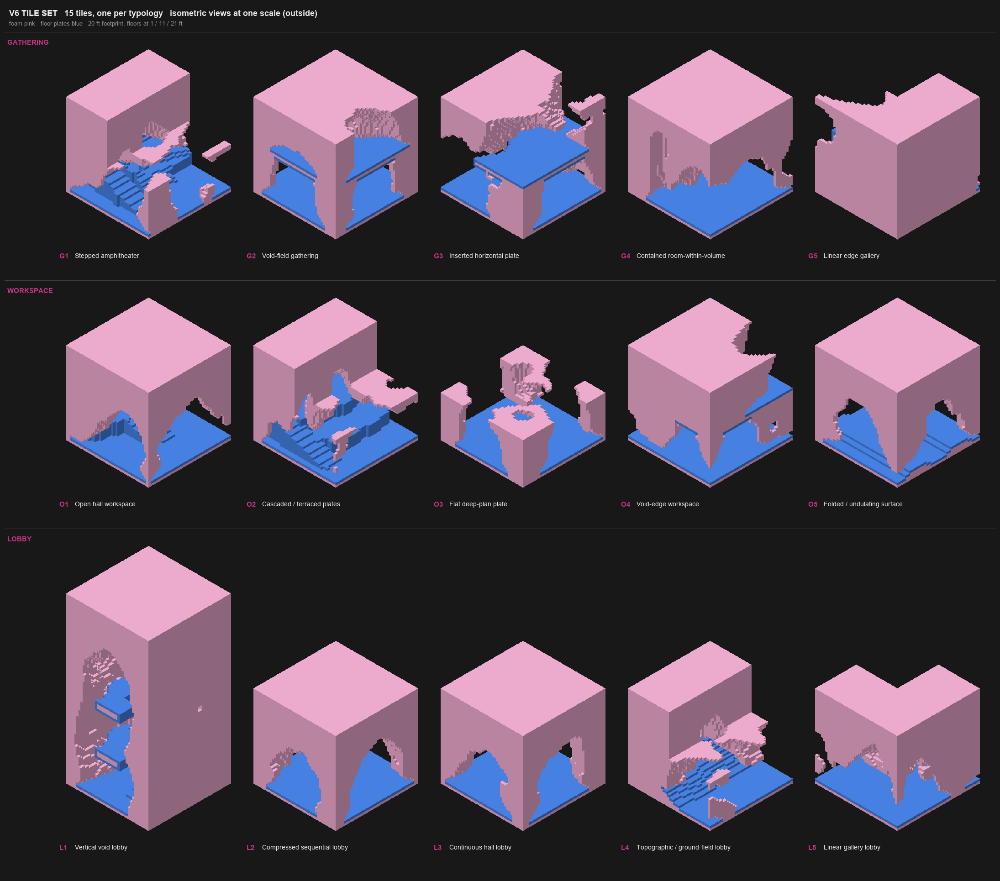

Cut away (the south-west corner removed above the ground slab; foam pink, floor plates blue where they meet a room):
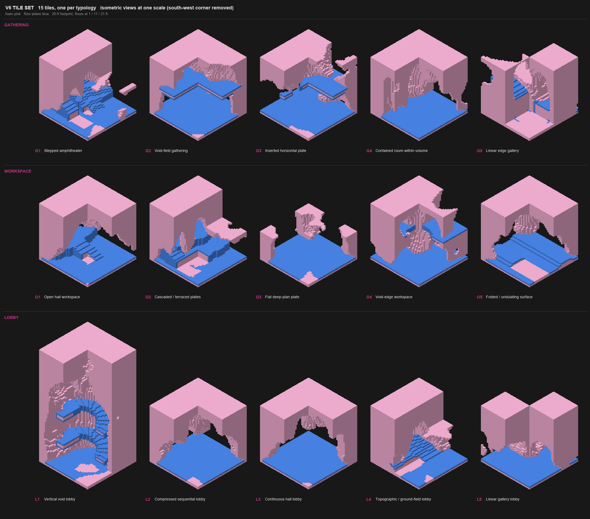

**Where things are**

| What | Where |
|---|---|
| the recipes (paste one into the engine's `recipe` panel; it ends with `RECIPE CHECK: OK`) | `engine/tiles/v6/recipes/<name>.recipe.json` (20: fifteen tiles and five backups) |
| the kit and the tile definitions (one function per tile; the docstring is the concept) | `engine/tiles/v6/kit6.py`, `paths6.py`, `defs_g.py`, `defs_o.py`, `defs_l.py` |
| pictures per tile: outside / cut-away isometric, a walking sheet (green = floor a person can walk) | `engine/tiles/v6/recipes/previews/` |
| the app's own evaluation table | `engine/tiles/v6/EVALUATION.md` |
| assembly evidence: the check's output and pictures of automatic assemblies | `engine/tiles/v6/assemblies/` |
| import-ready `_analysis` zips (20), the `_reference` zips, the whole set in one zip (local, git-ignored) | `engine/tiles/v6/package/` |
| committed fixtures (voxels + the engine's analysis) | `lib/tiles/fixtures-v6/` |
| the conventions, written for the next set | `docs/RECIPE_AUTHORING.md` (the V6 section) |
| how every part of the Assignment 2 brief is produced | `docs/ASSIGNMENT2.md` |

```
python engine/tiles/v6/build.py [G1 O3 G5c ...]  the real engine, headless: recipe, export, sections
python engine/tiles/v6/verify.py                 each recipe rebuilt from the file alone: RECIPE CHECK: OK, at most 24 sources, 32,000 characters
python engine/tiles/make_fixtures.py C:/tmp/tiles6 lib/tiles/fixtures-v6   then   npm run check:parity
npm run check:v6                                 every way Arrange can assemble them (writes engine/tiles/v6/assemblies/)
TILESET=v6 npx tsx scripts/v4/table.ts           the evaluation table (EVALUATION.md)
```

## 1. The design rules

| Rule | What V6 does |
|---|---|
| a cube you can interlock | a 20 x 20 x 20 ft container (O3 is one 10 ft storey, L1 is 40 ft tall), a thin worn skin held flat round every opening |
| rooms you can stand in | **8 ft clear** in main spaces, **7 ft** under shelves, ledges and soffits (the app's rule is 6.5 ft; the margin absorbs erosion noise) |
| openings that are really open | wide openings at the shared datums (ground 1 ft, 11 ft, 21 ft), 4.8 to 5.6 ft wide and 8.4 to 9.4 ft high, mixed per typology; small only where the concept needs it (G4's inner room, L2's slots) |
| floors you can walk | the main floor of every tile is one connected surface; stairs, ramps and ledges join the floors; a floor with no stair of its own (G2's and O4's upper fields, G3's plate) is a **receiving floor** and is said so |
| interlock beyond face to face | five tiles are **stepped**: a 10 ft notch is cut from the top; a cube shifted 10 ft in x or y and 10 ft up fills it (the 10 ft shifted lattice) |
| a way to take the cubic route | every stepped tile has a matching **cubic backup** (`v6c`): the same tile with the notch left out |

## 2. The design matrix

| | Typology idea | The block | Erosion logic | Floors and circulation | Interfaces |
|---|---|---|---|---|---|
| **G1** | Stepped amphitheater | cube, **front 10 ft of the roof cut 10 ft down** | a stage barrel and three barrels riding the seating up | contour terraces (1 ft risers, 2.4 ft treads) and a separate sloping ledge as the way up | -y at ground, +-x |
| **G2** | Void-field gathering | cube | a great barrel and four satellites per floor, joined where barrels meet | ground field and an upper field on a 1.6 ft shelf (a receiving floor) | four faces, both floors |
| **G3** | Inserted horizontal plate | cube | low barrels under, a hall over, a tall hall beyond the free lobed edge | ground floor; a shelf at 11 ft (a receiving floor) | four faces at ground, three on the shelf |
| **G4** | Contained room-within-volume | cube | a kernel of foam in a wrapping cave; a chamber carved inside | a walkable ring round the kernel; the room behind a throat | -y, +-x |
| **G5** | Linear edge gallery | cube, **north-east quarter cut 10 ft down** | one ledge of ground with a pod row above it; a landing and a door on the notch wall | one ledge from 1 ft to 11 ft (slope 0.36) | +x ground, +y at 11 ft, the notch wall |
| **O1** | Open hall workspace | cube | three overlapping barrels; the pillars are foam between them | a platform at 4 ft and a ramp, one hall | -y, +-x |
| **O2** | Cascaded / terraced plates | cube, **front 10 ft of the roof cut 10 ft down** | a cave riding two lobed shelves up | ground, shelf 2.5 ft, shelf 5 ft, one ramp | -y, +-x |
| **O3** | Flat deep-plan plate | 20 x 20 x **10** ft | four barrels, pillars between, skylights as shafts | one level | four faces |
| **O4** | Void-edge workspace | cube | floors wrap the outside of the block and look over a double-height void | ground and an upper floor (receiving) | the arm ends, both floors |
| **O5** | Folded / undulating surface | cube | nine barrels, one per fold station | a folded floor, slopes 0.3, one hall | four faces |
| **L1** | Vertical void lobby | 20 x 20 x **40** ft | a chimney and a two-turn spiral ledge, part of the rock | one floor from 1 ft to 21 ft (slope 0.27); doors at 1 / 11 / 21 ft on the west | west, three heights |
| **L2** | Compressed sequential lobby | cube | three tall chambers joined by narrow slots (the one place a narrow opening is the idea) | one floor through all three | four faces |
| **L3** | Continuous hall lobby | cube | a long nave with a rhythm of piers and arches on each side | one hall | four faces |
| **L4** | Topographic / ground-field lobby | cube, **front 10 ft of the roof cut 10 ft down** | a height field and a vault that follows it | the ground rises 5.5 ft; slope at most 0.45 | -y, +-x |
| **L5** | Linear gallery lobby | cube, **north-east quarter cut 10 ft down** | a ring gallery with a tall chamber at three corners | one floor along the ring | arm ends |

## 3. Measured (the app's own code; `engine/tiles/v6/EVALUATION.md`)

| | |
|---|---|
| floor reached on foot from a ground opening, mean of 15 tiles | 62% (V3: 33%) |
| ordered pairs with a walkable joint (225) | 206 (92%); counted either way round, 118 of 120 unordered pairs (98%) |
| tiles with at least one valid repeat / mirror / shift aggregation | 14 of 15 (L1 has none) |
| Auto Generate, five shapes x 2 / 4 / 8 pieces x three seeds | 45 of 45 results collision-free, one attached group, every piece reachable on foot; 29 mix all three categories |
| each stepped tile with each of the fifteen tiles at the 10 ft lattice shifts | all 5 x 15 collision-free nests (G1 448, G5 208, O2 448, L4 448, L5 208 placements) |
| walkable nests | **G5 with all 14 other tiles (77 walkable placements)**; G1, O2, L4 and L5 are walkable only with G5 |
| vertical meetings (a tile standing at an upper level of L1's ring ramp or G5's gallery) | 14 of 14 on each (702 and 256 walkable placements) |
| the app's analysis against the engine | matches on all 65 tiles (`npm run check:parity`) |

## 4. The tiles, one by one

Each tile has an isometric view and a walking sheet in `engine/tiles/v6/recipes/previews/`; the concept of each is the docstring of its function in `defs_g.py`, `defs_o.py`, `defs_l.py`.

**G1, Stepped amphitheater** (`gathering_1_stepped_amphitheater_v6`, backup `v6c`). A bowl in the block: a flat stage at the front, contour terraces for seating that climb to a rear walk 5 ft up, a separate sloping ledge as the way up, a roof that rides the seating. The front of the roof is stepped down 10 ft: a cube shifted 10 ft up and 10 ft over fills it. Main floor 129 ft², 40% of the floor reached on foot.
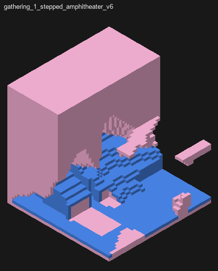 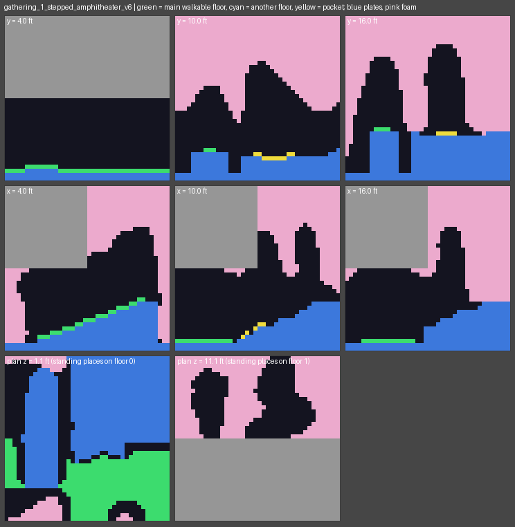

**G2, Void-field gathering** (`gathering_2_void_field_gathering_v6`). A field of separate rooms, each its own cave, divided by thick foam; two fields, one over the other. The upper field is a receiving floor. 57% of the floor reached.
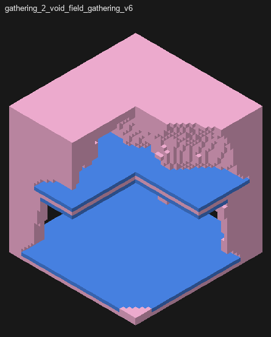 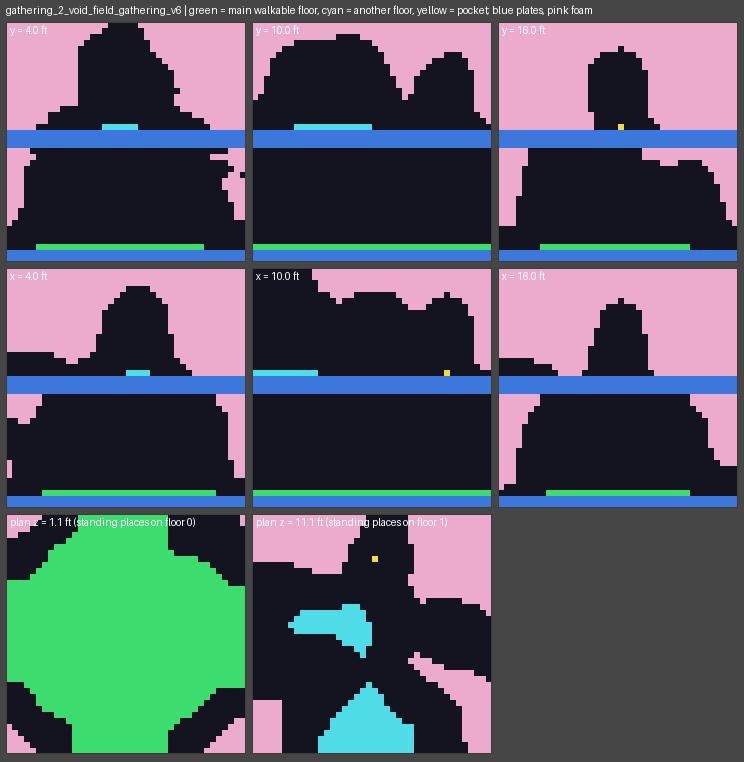

**G3, Inserted horizontal plate** (`gathering_3_inserted_horizontal_plate_v6`). One tall cave with a shelf pushed into it at the upper datum, ending in a free, lobed edge a little past the middle; a low room under it (7 ft clear), a hall over it, a double-height hall beyond. The shelf has no stair in a 20 ft cube: a neighbour's ramp arrives at it. 55% reached.
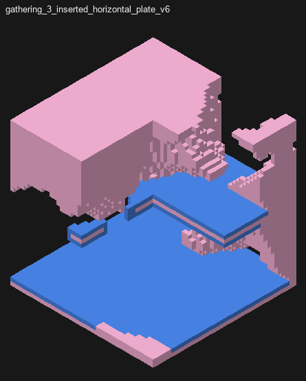 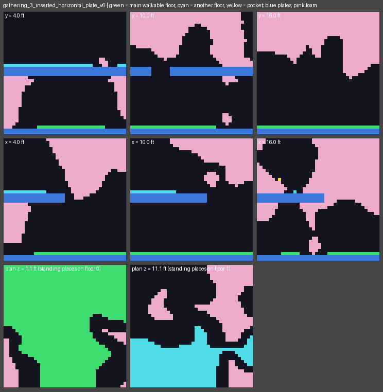

**G4, Contained room-within-volume** (`gathering_4_contained_room_within_volume_v6`). A kernel of foam stands in a tall cave and a small chamber is carved inside it; a walkable ring round the kernel joins the forecourt and both side passages. The inner room's door is the one small door the type needs. 69% reached.
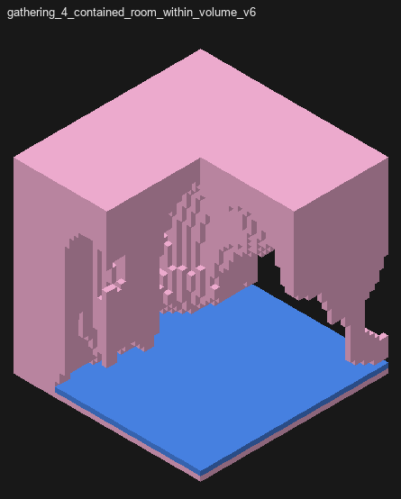 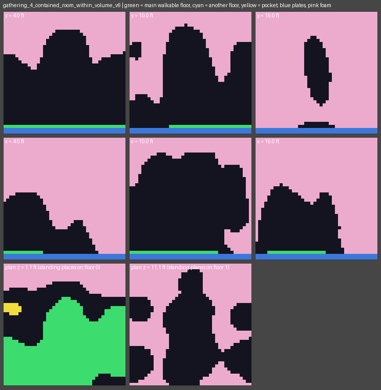

**G5, Linear edge gallery** (`gathering_5_linear_edge_gallery_v6`, backup `v6c`). A gallery 6 to 7 ft wide runs along two sides, climbing as one ledge from the ground datum to the upper datum, arriving at a landing; a door on the notch wall opens from the landing. The north-east quarter of the top is cut away: **a cube shifted 10 ft in x and y and 10 ft up fills it and is walkable from the landing** (with all 14 other tiles). 48% reached; 2 of 2 levels.
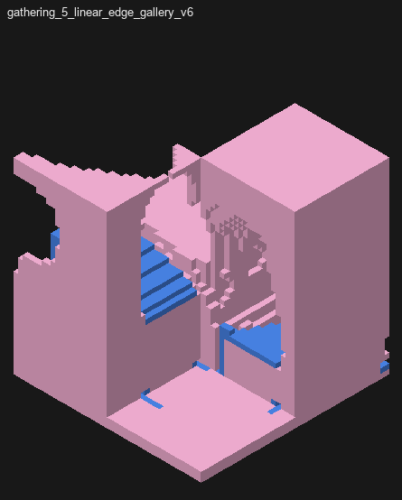 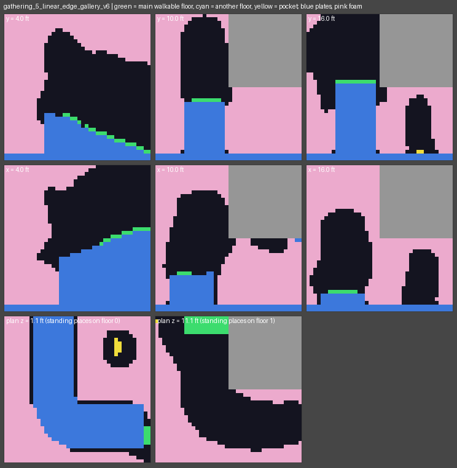

**O1, Open hall workspace** (`office_1_open_hall_workspace_v6`). One big vaulted cavern you can see across, made of three overlapping barrels so the foam between them stands as spurs and pillars; a raised platform of ground along the north side, reached by a natural ramp. 67% reached, three levels.
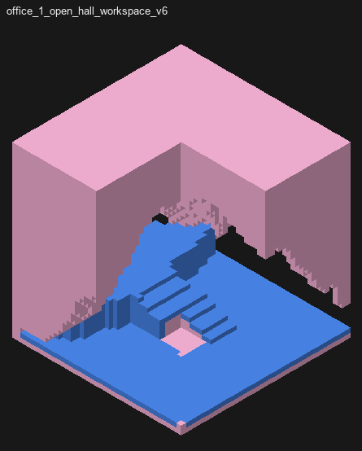 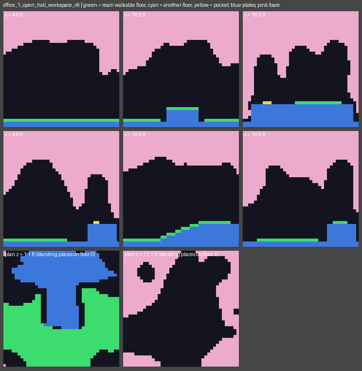

**O2, Cascaded / terraced plates** (`office_2_cascaded_terraced_plates_v6`, backup `v6c`). Floors that step up like terraces of travertine (ground, a shelf 2.5 ft up, a shelf 5 ft up), the drops too high to step, one ramp along the west wall meeting each shelf. The front of the roof is stepped down. 44% reached, all four levels.
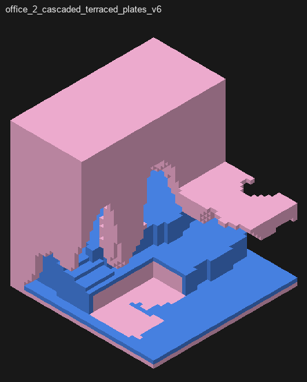 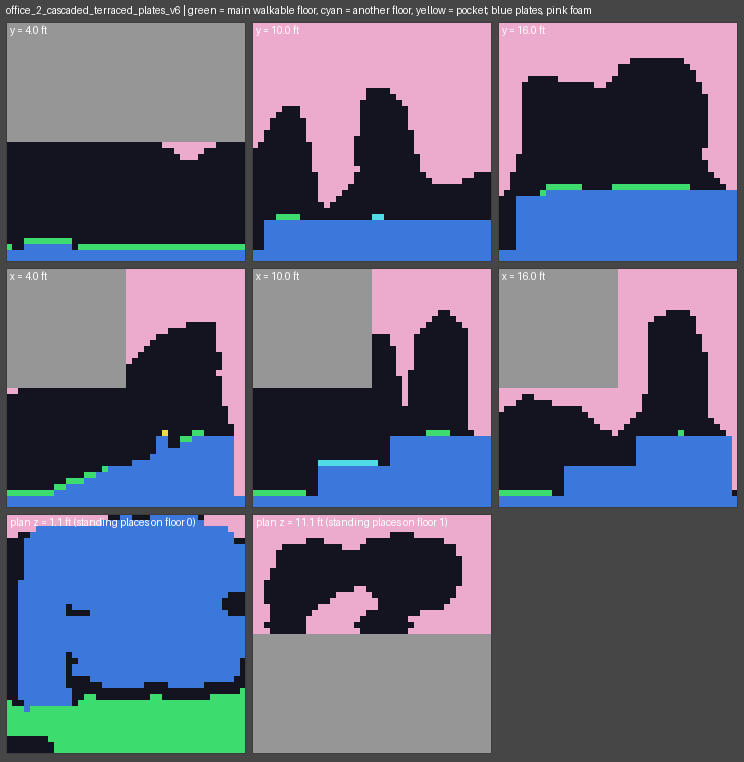

**O3, Flat deep-plan plate** (`office_3_flat_deep_plan_plate_v6`). A single 10 ft storey: a wide low cave of four overlapping barrels, the foam between them standing as pillars, four skylights that are shafts that reached the sky. 79% reached.
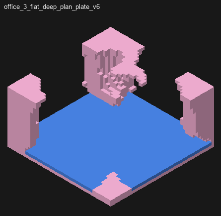 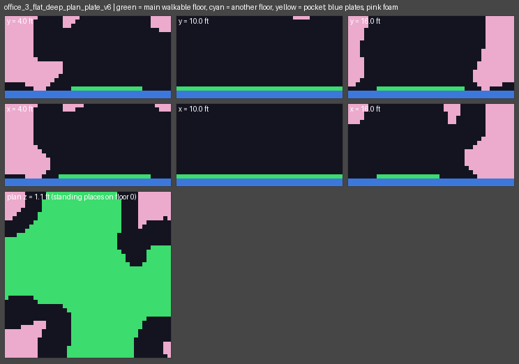

**O4, Void-edge workspace** (`office_4_void_edge_workspace_v6`). Workspace on two floors that wrap the outside of the block, looking over a double-height void at the north-east corner. The upper floor is a receiving floor. 40% reached; the weakest of the set for usable area (the wrapped floors are long and thin).
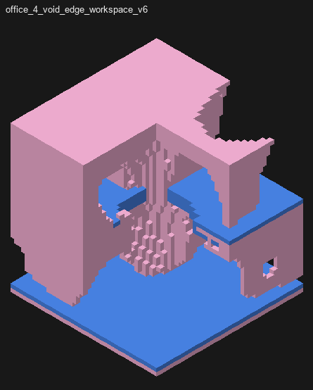 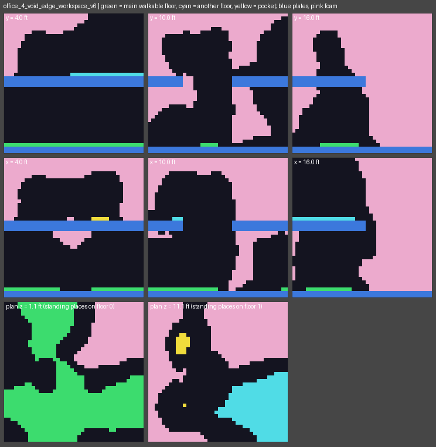

**O5, Folded / undulating work surface** (`office_5_folded_undulating_work_surface_v6`). A floor of soft folds (flat valley and ridge benches joined by slopes of 0.3) and a vault that follows the folds. 83% reached.
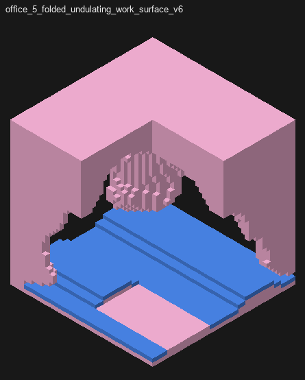 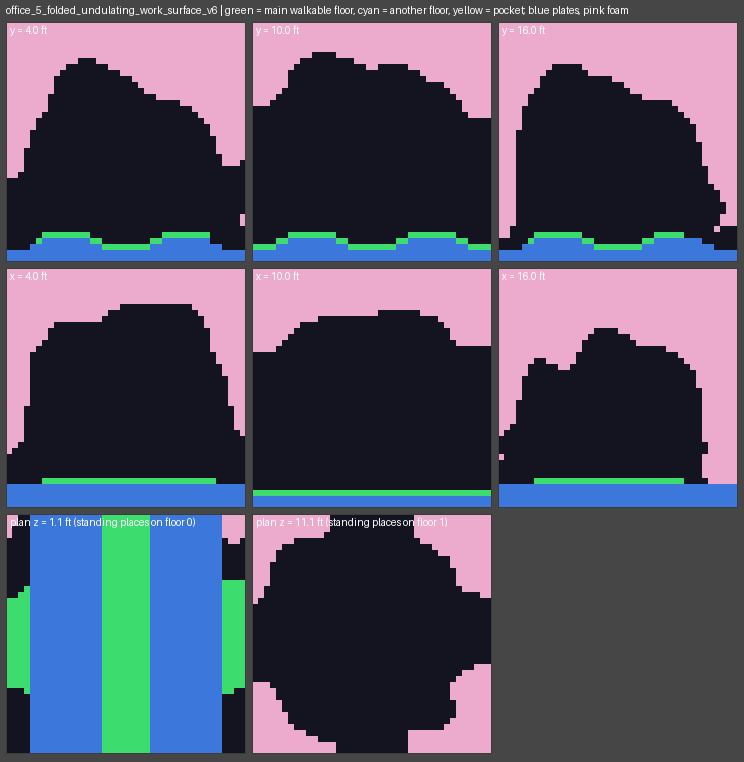

**L1, Vertical void lobby** (`lobby_1_vertical_void_lobby_v6`). A 20 x 20 x 40 ft block with one tall chimney of void and a natural spiral ledge that winds round it twice and climbs two storeys; the doors stack on the west wall at 1, 11 and 21 ft, so you arrive at the foot of the void and climb round it. 61% reached; three levels.
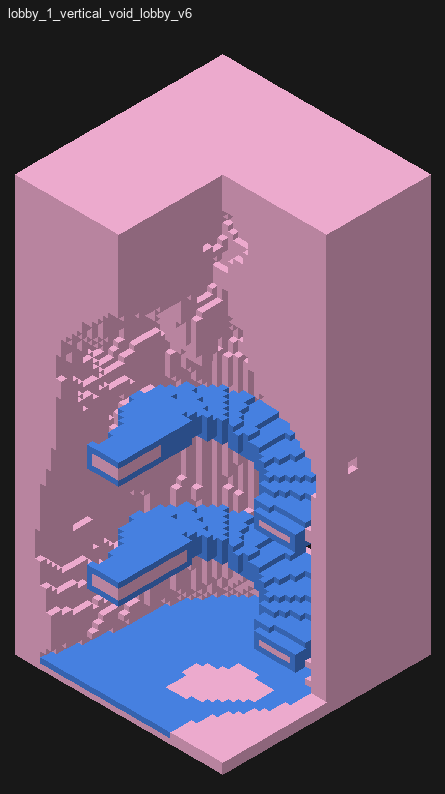 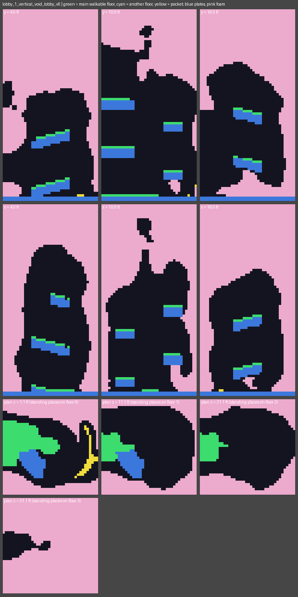

**L2, Compressed sequential lobby** (`lobby_2_compressed_sequential_lobby_v6`). Three tall chambers one after another from south to north, joined where the foam between them is pierced by a narrow, tall slot: low and narrow, high and wide, narrow, wide. The slots are the one narrow opening in the set. 76% reached.
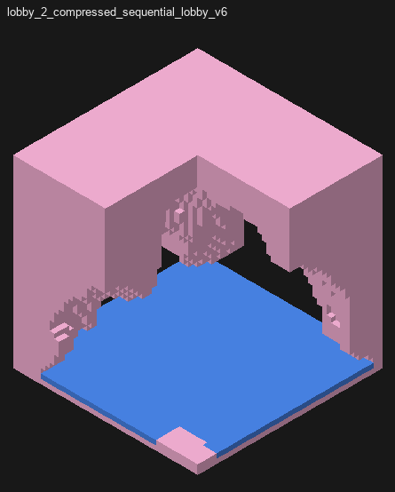 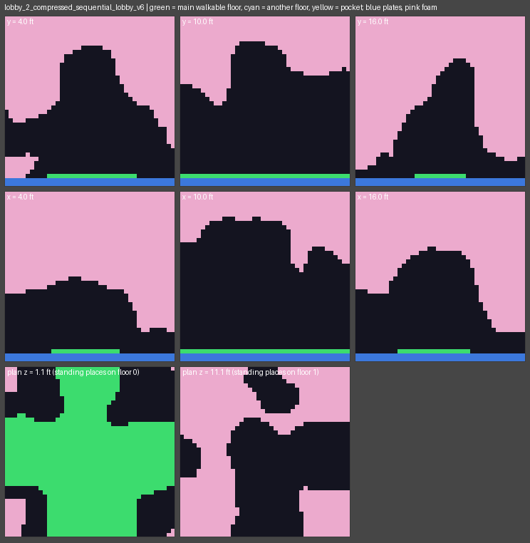

**L3, Continuous hall lobby** (`lobby_3_continuous_hall_lobby_v6`). A long nave, 8 ft wide and 17 ft high, the whole length of the tile, with a low aisle on each side separated by a perforated wall of piers and arches. 80% reached.
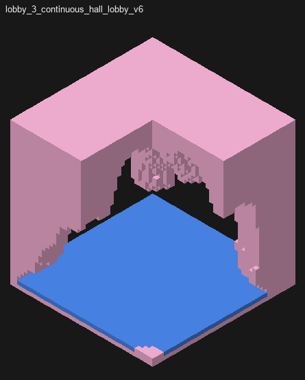 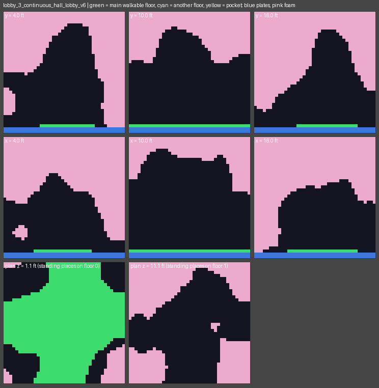

**L4, Topographic / ground-field lobby** (`lobby_4_topographic_ground_field_lobby_v6`, backup `v6c`). The floor is a landscape: a broad swell and two low mounds rising from the datum to 5.5 ft, walked as a field; the roof is the counter-landscape. The front of the roof is stepped down. 61% reached.
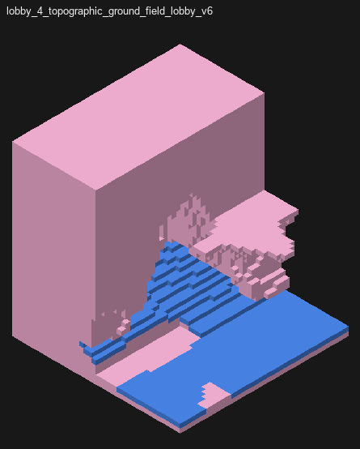 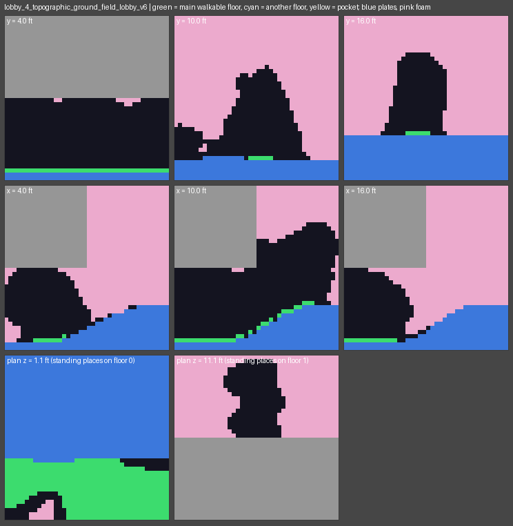

**L5, Linear gallery lobby** (`lobby_5_linear_gallery_lobby_v6`, backup `v6c`). A ring gallery round the edge: a long low gallery from chamber to chamber with a tall chamber at three corners; the fourth, north-east corner chamber loses its top and a shifted cube nests in it. 63% reached.
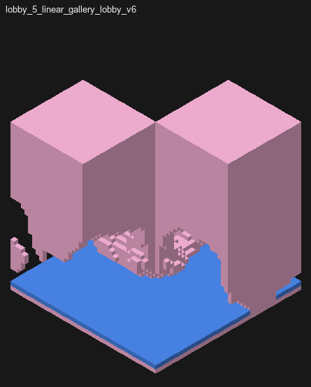 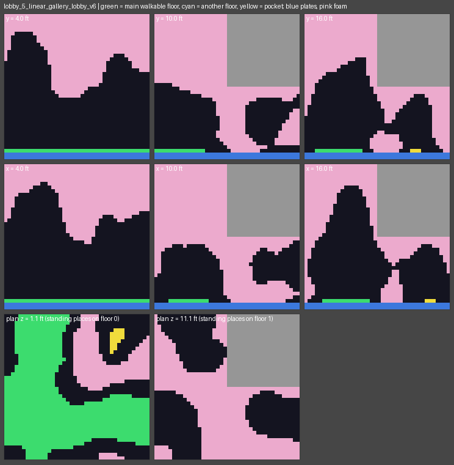

## 5. Limits, honestly

- **Only G5's nest is a route.** G1, O2, L4 and L5 nest collision-free with every tile, but their notch walls carry no door, so the nested cube is reached from its other neighbours, not through the notch. Doing for those four what G5 does (a landing and a door on the notch wall) is the next step; it costs openings and, at 24 sources, sources.
- **Auto Generate does not choose nests yet.** It only keeps walkable fits, and it never picked G5 (a low-density gallery scores low on compactness), though G5 assembles with 13 of 14 hosts. The 5 x 15 nesting section is the evidence.
- **Usable area** is high for the simple tiles (O5 83%, O3 79%, L3 80%) and lower where the idea is a thin floor on an edge (O4 and G1 40%, O2 44%). Receiving floors (G2 and O4 upper fields, G3's plate) are completed by a neighbour.
- **L1 makes no valid repeat / mirror / shift line by itself** (its doors are all on one wall, at three heights), but it works as a host: 14 of 14 tiles stand on its ring ramp.
- **Print and support**: the tiles carry the usual overhang warnings (16 to 29% of the foam surface faces down over void) and a few specks (under 8 ft³) outside the main body; both are reported by the Analysis tab, not hidden.
