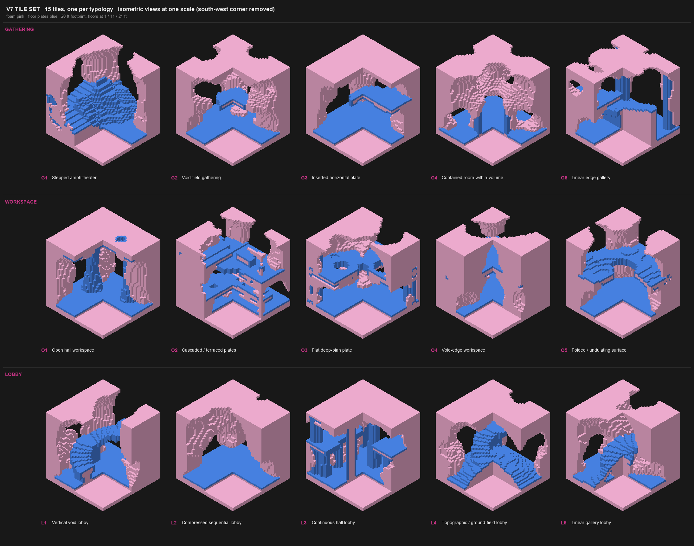

# The V7 tile set: the first set (V3), kept, with small changes so it walks and joins

V3 was the set the project liked: fifteen smooth, carved masses, each a 20 x 20 x 20 ft cube with big carved openings on its faces. Its weak point was the inside: floors that broke into pockets, ceilings too low to walk under, a few faces with no opening. V7 is **the same fifteen recipes with the same seeds**, edited by a few numbers each (the recipe of every tile is `engine/tiles/v7/defs7.py`, copied from `engine/tiles/tile_defs.py`; the docstring of each function says what V7 changed). O1 is untouched: its tile id is the same as V3's (`de261027d371d7e3`). The engine script is not changed.

The fifteen V7 tiles, cut away (south-west corner removed; foam pink, floor plates blue):


**Where things are**

| What | Where |
|---|---|
| the recipes (paste one into the engine's `recipe` panel; it ends with `RECIPE CHECK: OK`) | `engine/tiles/v7/recipes/<name>.recipe.json` |
| the tile definitions: V3's, edited (`lport` = a low port that reaches the floor) | `engine/tiles/v7/defs7.py`; the V3 originals stay in `engine/tiles/tile_defs.py` |
| pictures per tile (outside / cut-away isometric, a walking sheet) | `engine/tiles/v7/recipes/previews/` |
| the app's own evaluation table | `engine/tiles/v7/EVALUATION.md` |
| import-ready `_analysis` zips (15), reference zips, the whole set in one zip (local, git-ignored) | `engine/tiles/v7/package/` |
| committed fixtures | `lib/tiles/fixtures-v7/` |

```
python engine/tiles/v7/build.py [G1 O3 ...]       the real engine, headless (seconds per tile)
python engine/tiles/v7/verify.py                  each recipe rebuilt from the file alone: RECIPE CHECK: OK, 24 sources at most
python engine/tiles/make_fixtures.py C:/tmp/tiles7 lib/tiles/fixtures-v7   then   npm run check:parity
npm run check:v7                                  every way Arrange can assemble them
```
(Use Rhino's bundled Python 3.9 for the first three.)

## What changed, tile by tile

| | V3 | V7 change | Floor now (main, reached on foot) |
|---|---|---|---|
| **G1** Stepped amphitheater | seating terraces, a stage too small to stand on (25 sq ft) | the same bowl and seating (a thicker shell so it prints; the three bitten pits are gone, so the seating plate has no holes); a larger flat stage at the -Y door; a gentle ledge (slope 0.33) up the west and north walls; four corner piers | 114 sq ft, from the stage up the ledge to 7 ft; the upper ledge (19 sq ft) is a separate floor |
| **G2** Void field | pods joined by throats floating 2 ft above the floor | rooms wider and lower, throats on the floor, a low port on each face | 167 sq ft ground floor touching all four doors; the upper floor is a receiving floor |
| **G3** Inserted plate | no opening on -Y | open -Y at ground and onto the tongue; the tongue is reached from another space, no stair; the upper cavern and upper doors are lowered so the roof is at least 1 ft thick everywhere (2 ft over most of the tile) | 243 sq ft ground; the tongue (49 sq ft, smaller because it needs 6.5 ft of headroom under a thicker roof) reached from -Y |
| **G4** Contained room | thin pedestal, a tiny room | the kernel is a retained dome of foam with a room carved in it (about 6 ft across, 7 ft clear) and a door; a ring on the floor around it | 149 sq ft ring floor including the room; the -Y door lands on a 26 sq ft pocket |
| **G5** Linear edge gallery | both gallery levels narrow and low | both levels widened to 7 ft clear; a ramp (slope about 0.42) running along the hall edge up to the upper gallery, with a solid spine under it down to the ground; two corner piers | 210 sq ft, one floor from the hall (2 ft) up the ramp to the gallery (12.5 ft) |
| **O1** Open hall | works | unchanged | 179 sq ft |
| **O2** Cascaded plates | top plate under 3.4 ft of roof | the roof above the top plate opened to the sky; the plates are untouched, no ramp | four floors: 79 ground, 66, 91 and 56 sq ft (an open terrace) |
| **O3** Flat deep plan | ground storey too low, doors at the limit | ground and upper rooms widened, doors on the floor; four corner piers carry the roof; the three light wells start above the ground storey and the slab is harder, so the bottom plate is whole | 231 sq ft ground; upper floors 62 and 32 sq ft |
| **O4** Void edge | two entrances raised 8 ft with no floor | ground-level openings into the foot of the void | 131 sq ft ground, 111 sq ft upper; the void foot (46 sq ft) is a separate pocket |
| **O5** Folded surface | narrow ground band | wide ground hall under the fold; a hole cut through the second floor at the centre | 174 sq ft upper, 140 sq ft ground |
| **L1** Vertical void | ledges floating in the void | the V6 stair feel in a single cube: a ledge winding three quarters of a turn from the entry to a landing at 12 ft, with two flat landings (the terraces); a solid spine under the lower part of the stair, down to the ground; the top landing now runs flat at 12 ft out to the +X face, so a neighbour's floor at that height meets it | 176 sq ft, one floor from 2 to 12.5 ft |
| **L2** Compressed lobby | pinches too low to walk, similar to L3 | tall keyhole slots (about 4.5 ft wide, 8 ft high) between wide ends and a very tall vaulted hall | 244 sq ft, all four faces |
| **L3** Continuous hall | double-height nave, similar to L2 | a long even hall with a raised roof (about 17 ft clear) under a sealed flat roof plate (1 ft); two terraces at the second-floor height (11.6 to 12 ft) stand on six pillars along the long walls and run out to the side faces; six piers carry the roof | 136 sq ft hall floor, two terraces of 43 and 40 sq ft, open at both ends |
| **L4** Topographic | the landscape started 0.5 ft above the door floors, so it joined nothing | a flat apron at the edges and low ports on all four faces; an overlook on the north-east mound reached by a short ramp, with a spine and a column under it | about 206 sq ft, from 2 to 10 ft |
| **L5** Linear gallery | only two faces open | the V3 ramp kept as it is; -Y and +Y opened at the ground | 165 sq ft, from 2 to 12.5 ft |

## Measured (the app's own code; `engine/tiles/v7/EVALUATION.md`)

| | V3 | V7 |
|---|---|---|
| floor usable on foot, mean of 15 | 33% | about 45% |
| ordered pairs with a walkable joint (225) | 111 | 198 (88%) |
| unordered pairs that join on foot either way round (120) | not counted | 117 (98%) |
| tiles that join no other tile | G2, L1, L4 | none |
| tiles with a valid repeat / mirror / shift aggregation (of 15) | 10 | 14 |
| the app's analysis against the engine | matches | matches (80 tiles in all) |

## Printing

Checked on the smooth surface the app prints from (`void_smooth`): every tile is **one piece**, nothing floats (the only free foam anywhere is about 1 cu ft of specks at cube corners), and no part of any tile hangs on a neck thinner than 1 ft. Where V7 had a roof or a ramp that depended on thin foam, it now has retained **piers** (`piers()` in `defs7.py`: round columns from the ground slab to inside the roof) or a **spine** (`spine()`: a solid wall under the middle of a ramp or stair, down to the ground). A walkable slope has to stay under about 0.5 (the app reads the floor within 1 ft), so ramps are long: G5 runs the whole edge of the hall.

## Limits

- G1, L4 and L5 can only be a **second** tile in the pair matrix (their floors are not on their +X face); in Arrange they join from any face once rotated.
- G1's seating risers are over 0.5 ft, so the app counts the seating as seating, not floor. The ledge is the walkable way up.
- The foam is carved harder than in V3 in several tiles (void share up from about 50% to about 55–65%).
- G1: the rim ledge reaches 7 ft in one piece and then continues as a separate 19 sq ft ledge (a gap I could not close without changing the bowl).
- Thin slivers (1 to 5 cu ft each, 18 across the set, most in L1) stand free between pods; they are attached, but fragile.
- Not done: G4's -Y door pocket, O4's void-foot pocket and L5's -Y pocket are not connected to the main floor.

## Touch-ups after the first print round (2026-10-06)

- **G1** the three pits bitten through the seating (cut sources) are gone, so the seating plate has no holes.
- **G3** the upper cavern and the upper doors are lowered, so the roof is at least 1 ft thick everywhere and about 2 ft over most of it (it was 0.5 ft across a wide area). Cost: the upper tongue floor is smaller (49 sq ft, was 111), because its 6.5 ft of headroom comes out of the roof.
- **O3** the three light wells used to cut through the bottom slab (14 sq ft of holes). They now start above the ground storey and the slab is harder (`_ground(res=5.0)`). The wells through the mid floor stay.
- **L1** the stair's top landing runs flat at 12 ft out to the +X face, 5 ft wide, so a neighbour's floor at that height meets it.
- **L3** the roof is raised (about 17 ft clear) and sealed with a protected 1 ft roof plate; two terraces at 11.6 ft (43 and 40 sq ft) stand on six pillars along the long walls and run out to the side faces, with the hall piers carrying the roof. The hall floor is 136 sq ft (was about 200): the height costs floor.
- Checked on all 15: base slab solid, nothing floating, no neck under 1 ft; 198 of 225 ordered pairs and 117 of 120 either way round walk. Loaded as project `v7print3`.
